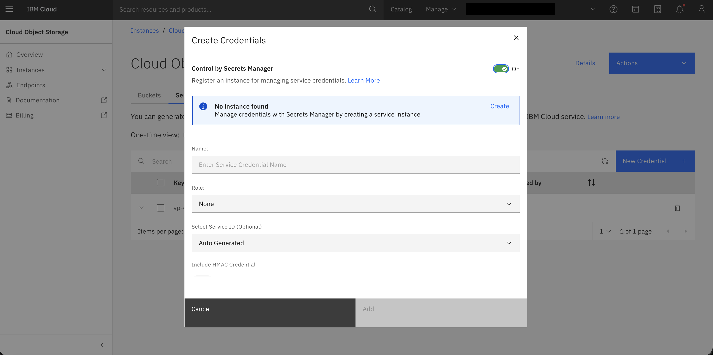

---

copyright:
  years: 2026
lastupdated: "2026-04-28"

keywords:

subcollection: sandbox
content-type: tutorial

---

{{site.data.keyword.attribute-definition-list}}

# Creating a Cloud Object Storage (COS) instance
{: #create-cos}

Following are the steps to Cloud Object Storage (COS) instance:

1. Navigate to **Menu** > **Infrastructure** > **Storage** > **Object storage**.

2. Click **Create an instance**.

3. Configure the instance:

    * Select a pricing plan.
    * Review the instance name.

4. Click **Create**.

    "){: caption="Create Cloud Object Storage (COS)" caption-side="bottom"}

5. From the instance, go to the **Service Credentials** tab and click **New Credential** so that your applications or services can access the COS instance.

6. Configure the credentials:

    - If you do not wish to use Secrets Manager, turn off the toggle.
    - You can click **Create** to create a secret manager.
    - Enter the credential information.

    {: caption="COS credentials" caption-side="bottom"}

7. Click **Add**.

## Creating a COS bucket
{: #create-cos-bucket}

1. Navigate to **Menu** > **Infrastructure** > **Storage** > **Object storage**.

2. In the left navigation, select an instance.

3. Click **Create Bucket**.

4. You may choose a template or create a custom bucket.

5. For a custom bucket, configure:

    - A unique name is provided. Review or enter a new name.
    - Choose the Resiliency and Location.
    - Select the Storage Class (Standard, Vault, Cold Vault, Flex)
    - Configure any other options as required.

6. Click **Create bucket**.
