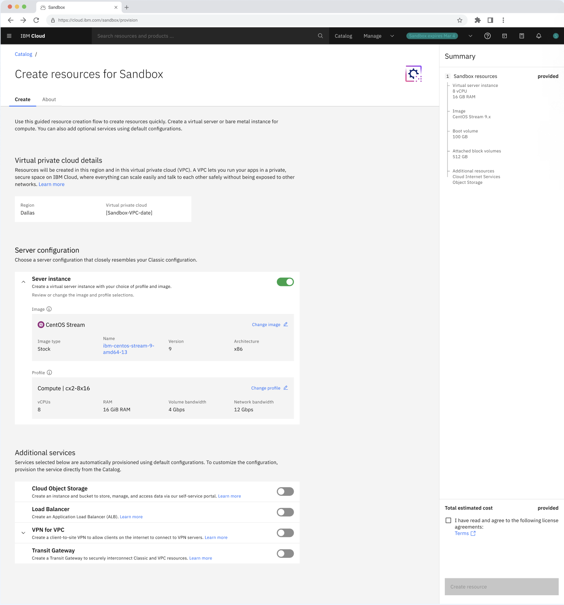

---

copyright:
  years: 2026
lastupdated: "2026-04-28"

keywords:

subcollection: sandbox

content-type: release-note

---

{{site.data.keyword.attribute-definition-list}}

# Creating resources in Sandbox
{: #create-resource}

On this Sandbox Overview page, you can create the resources quickly. You can create virtual server or bare metal instance for compute. You can also add optional services using the default configuration.

1. You can see the **Create resources for Sandbox** on the Overview page.

    {: caption="Sandbox - Overview" caption-side="bottom"}

2. Under **Server Configuration**:

    * By default, the image is selected. But if you want to change then, select the **image** to configure the instances.

    {: caption="Select image - Server instance" caption-side="bottom"}

    * By default, the profile type is selected. But if you want to change then, select the **instance profile type**.

    {: caption="Select profile - Server instance" caption-side="bottom"}

3. Under **Additional services**, you can enable and customize the services.

    * **Cloud Object Storage** - Deploy scalable object storage for data, backups, and application content.

    * **Load Balancer** - Configure load balancers to distribute traffic across multiple server instances for high availability.

    * **VPN for VPC** - Set up secure VPN connectivity to access your sandbox environment from on-premises networks or remote locations.

    * **Transit Gateway** - Connect multiple VPCs or integrate with on-premises networks for hybrid cloud scenarios.

5. On the right-side, you can see the **Summary** and verify the configuration of the services created.

6. Accept the terms and conditions, click **Create resources**.

7. You can view the created resources under **Resource list**.
