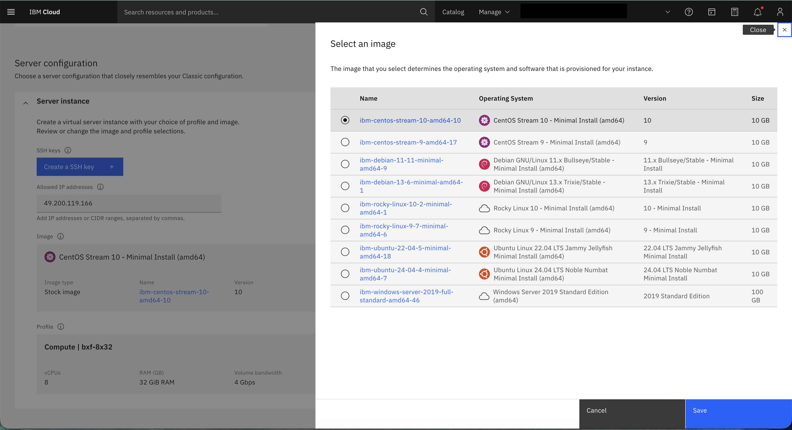
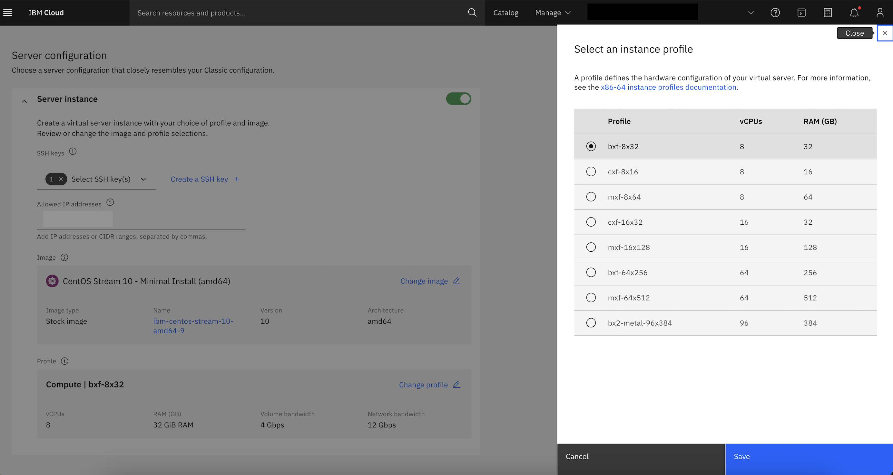

---

copyright:
  years: 2026
lastupdated: "2026-08-27"

keywords:

subcollection: sandbox

content-type: release-note

---

{{site.data.keyword.attribute-definition-list}}

# Creating resources in Cloud Sandbox
{: #create-resource}

Provision and configure compute resources in your {{site.data.keyword.sandbox_full_notm}} environment, including Virtual Server Instances (VSIs) or Bare Metal servers, along with optional services such as {{site.data.keyword.cos_short}}, Load Balancer, VPN, and Transit Gateway.
{: shortdesc}

On the **Sandbox Overview** page, you can create compute resources such as Virtual Server Instances or Bare Metal servers. You can also add optional services using the default configuration.

1. On the **Sandbox Overview** page, click **Create resources**.

2. Under **Server configuration**, click **Create a SSH key** to create a SSH key to access the server.

3. To choose an operating system image from the available options, click **Change image**.

    {: caption="Select image - Server instance" caption-side="bottom"}

4. To choose an instance profile from the available options, click **Change profile**.

    {: caption="Select profile - Server instance" caption-side="bottom"}

5. Under **Additional services**, enable the optional services that you want to use:

    * **{{site.data.keyword.cos_full_notm}}** - Deploy scalable object storage for data, backups, and application content.

    * **Load Balancer** - Distribute network traffic across multiple server instances to enhance availability and reliability.

    * **VPN for VPC** - Establish a secure connection between your Cloud Sandbox VPC and an external or on-premises network.

    * **Transit Gateway** - Connect multiple VPCs and integrate with on-premises networks to support hybrid cloud connectivity.

4. Review the resources listed in the **Summary**, accept the terms and conditions, and click **Create resources**.

5. Click **Create resources**.

You can view the created resources under **Resource list**.
