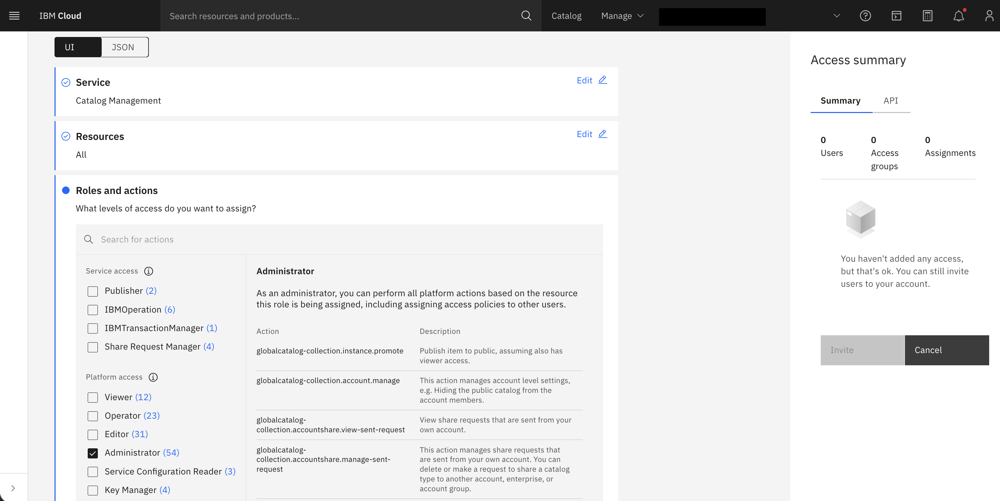

---

copyright:
  years: 2022, 2023
lastupdated: "2026-05-04"

keywords:

subcollection: sandbox

---

{:shortdesc: .shortdesc}
{:codeblock: .codeblock}
{:screen: .screen}
{:external: target="_blank" .external}
{:pre: .pre}
{:tip: .tip}
{:note: .note}
{:beta: .beta}
{:important: .important}

# Creating a user
{: #create-user}

Users can only be added during Sandbox provisioning from the catalog tile. To add users to your account, follow these steps:

1. In the {{site.data.keyword.Bluemix_notm}} console, **select Manage** > **Access (IAM)**.

2. In the *IAM navigation* menu, select **Users**.

3. Click **Invite** users.

4. Enter the email addresses.

5. Select **Access policy** and search for Sandbox you want to assign.

6. Select **Access policy**. Search for Sandbox and select it. Click **Next**.

7. Select Roles and Action and assign the level of action you want to provide for the user. Click **Review**.

8. To add this level of access for these users, click **Add**. It will be added to the summary panel. You can add additional access policies if desired, or click **Invite** to send email invitations.

9. On the right-hand side, click **Invite**.

The user gets an email invitation with the link to complete the process. This will add the user in the User list and to the Sandbox provisioning page.

{: caption="Creating a user" caption-side="bottom"}
