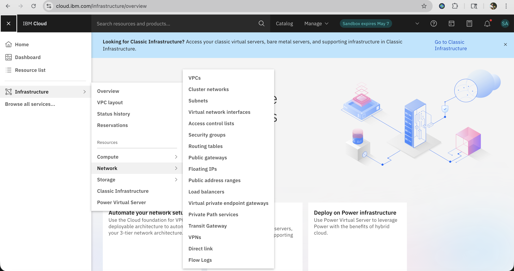
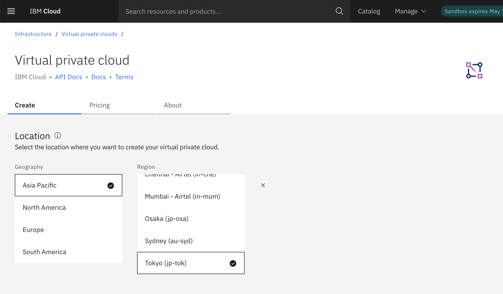
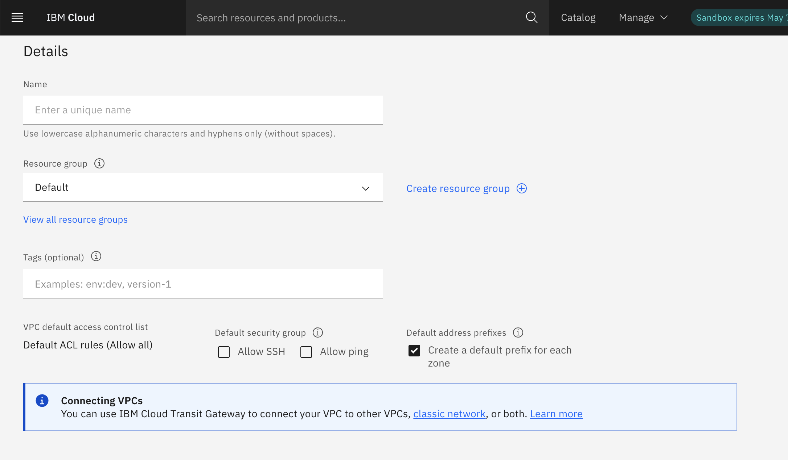
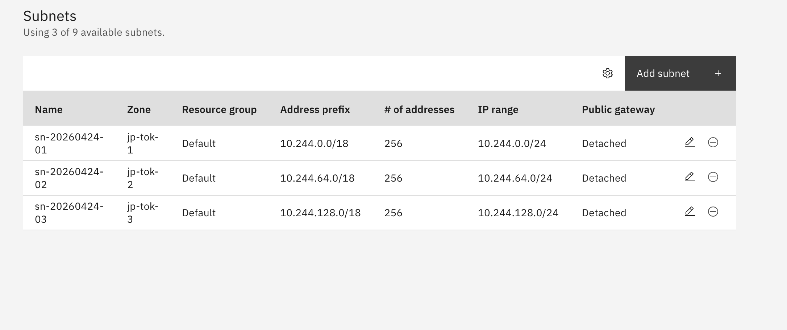
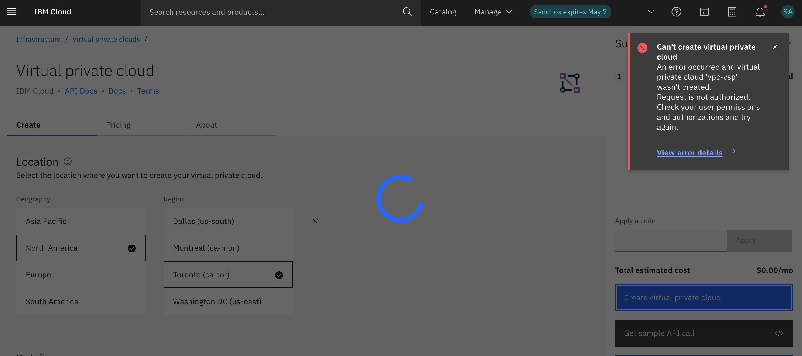

---

copyright:
  years: 2024, 2026
lastupdated: "2026-04-23"

keywords: transit gateway, classic to vpc, ssh access, rdp access, server connection, data migration

subcollection: sandbox

---

{{site.data.keyword.attribute-definition-list}}

# Creating a VPC
{: #create-vpc}

A virtual private cloud (VPC) is a secure, isolated virtual network that combines the security of a private cloud with the availability and scalability of IBM's public cloud.

To create and configure your VPC in the Cloud Sandbox account, perform the folowing steps:

1. In the [IBM Cloud console](/catalog#highlights), navigate to **Menu** > **Infrastructure** > **Network** > **VPCs**.

    {: caption="VPC homepage" caption-side="bottom"}

2. Click **Create**.

3. Under the **Create** tab, update the following details:

    * Under **Location**, you need to select the **Geography** and **Region** same as the one updated during the Sandbox provisioning.

    {: caption="VPC region" caption-side="bottom"}

    * Under **Details**, provide a unique name. Use lowercase alphanumeric characters and hyphens only (without spaces).

    * Under **Resource group**, you can select the existing resource groups from the drop-down or create a new one.

    * Tags (Optional)

    {: caption="VPC details" caption-side="bottom"}

4. Under **Default security group**, select whether the VPC's default security group allows inbound SSH and ping traffic. You can modify the default security group later. Enable the checkboxes.

5. Under **Subnets**, you can view the subnet created.

    {: caption="VPC subnet" caption-side="bottom"}

6. Click **Create virtual private cloud**.

* You will be redirected to the page where your VPC is created.

If the **Geography** and **Region** provided are different from those used during provisioning, VPC creation fails.

{: caption="VPC creation - fail" caption-side="bottom"}
