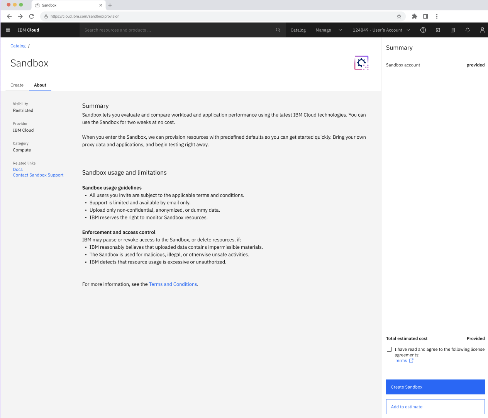
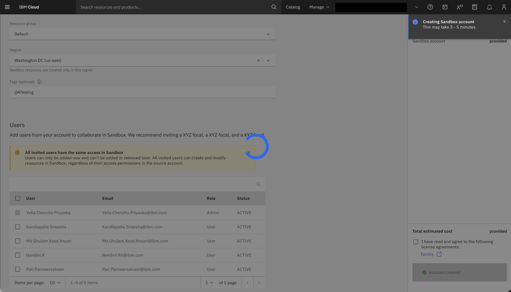
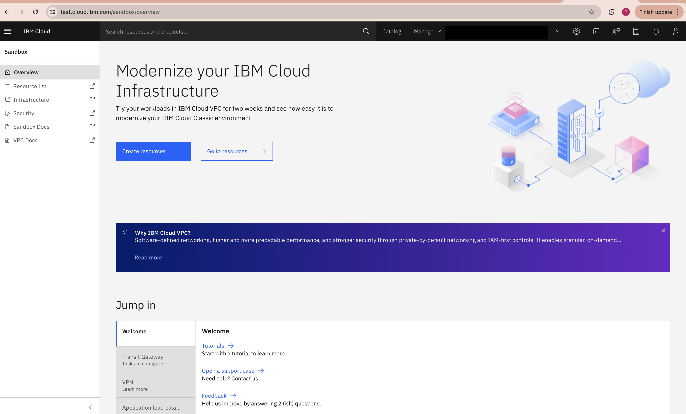
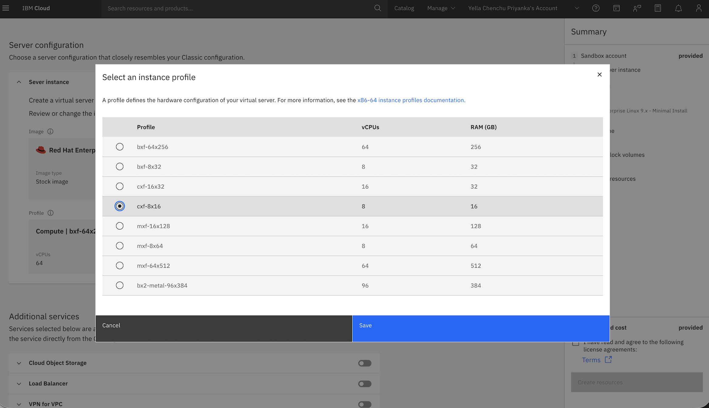
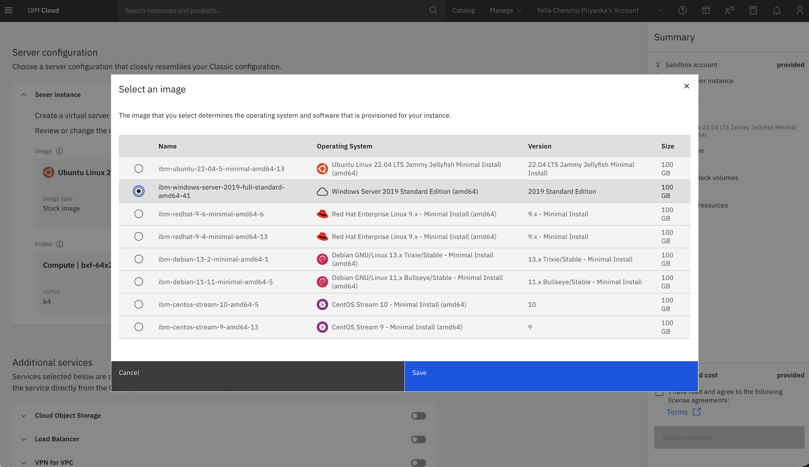
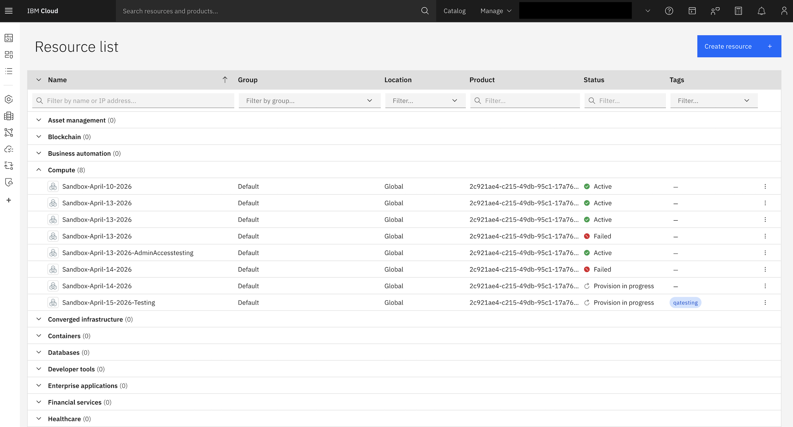
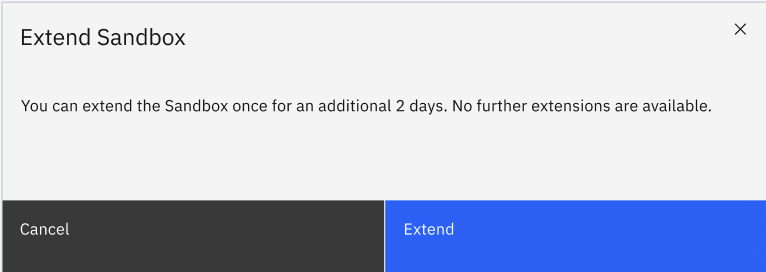
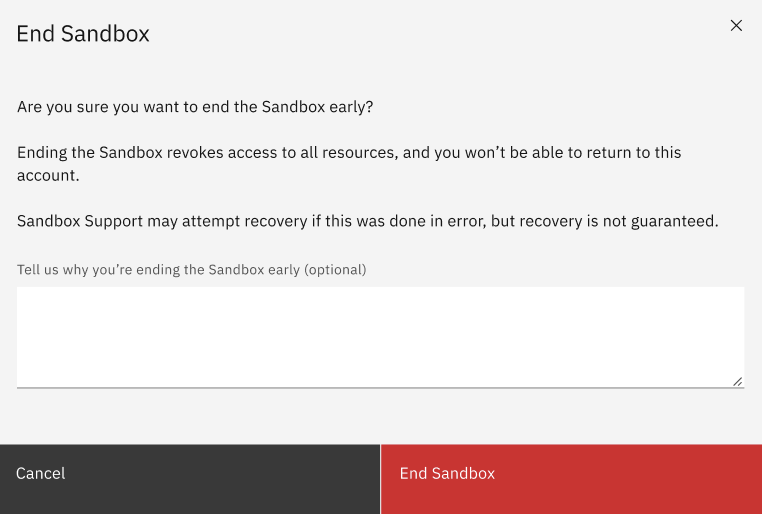

---

copyright:
  years: 2026
lastupdated: "2026-04-15"

keywords:

subcollection: sandbox

content-type: release-note

---

{{site.data.keyword.attribute-definition-list}}

# Deploying the IBM Cloud Sandbox
{: #deploy}

The solution uses the IBM Cloud Catalog service to ensure a unified and consistent approach.

## Creating the account using UI
{: #create-ui}

1. An email notification is sent to the allowlisted customers to access the {{site.data.keyword.vpc_short}} environment using the new **IBM Cloud Sandbox**. This is a cost-free configuration.

2. After clicking the **Request** button on the email, you will be navigated to the [IBM Cloud catalog](https://cloud.ibm.com/catalog#highlights). Search for Sandbox offering.

    {: caption="Sandbox - Catalog page" caption-side="bottom"}

3. In the **Create** tab, provide the following information under **Details** section:
    * **Sandbox name** - Name of the sandbox instance.
    * **Region** - Region where the instance is provisioned.
    * **Resource group** - Name from your IBM Cloud account where the VPC resources must be deployed.
    * **Tags (optional)** - These the key-value labels used to organize, filter, and manage cloud resources efficiently.

4. In the **Users** section, the creation page allows users to initiate Sandbox provisioning. Only one active sandbox is permitted per allowlisted customer account. Region selection applies only to IAM-based resource restrictions, not sandbox provisioning.

5. In the **About** tab, you will get all the details and overview of the service.

    {: caption="Sandbox - About page" caption-side="bottom"}

6. After accepting the terms and conditions, click **Create Sandbox**.

    {: caption="Sandbox - Create" caption-side="bottom"}

    {: caption="Sandbox - Create account" caption-side="bottom"}

7. Sandbox account is created for provisioning. This includes a 14-day trial period with a 48-hour extension. User access is limited to the region selected during provisioning.

8. The Sandbox instance will be be displayed for provisioning in the **Resource list**.

    {: caption="Sandbox - Resource list" caption-side="bottom"}

9. A welcome email is sent and you can successfully login to the Sandbox account.

10. You can continue without selecting a trusted profile by clicking **Continue** or select a trusted profile for the Sandbox.

11. On the main Sandbox dashboard, click **Create Resources**.

    {: caption="Sandbox - Create Resources" caption-side="bottom"}

12. Select the instance profile.

    {: caption="Sandbox - Instance profile" caption-side="bottom"}

13. Select an image for the available operating system.

    {: caption="Sandbox - Image selection" caption-side="bottom"}

14. In the Resource list, you can see all the resources that you have created.

    {: caption="Sandbox - Resource page" caption-side="bottom"}

15. In the **Manage Sandbox**, you can save the configuration by downloading the Terraform package and running the same in the customer account.

    {: caption="Sandbox - Manage" caption-side="bottom"}

16. In the **Extend Sandbox**, you can extend the duration of the Sandbox trial environment. The extension is for 48 hours.

    {: caption="Sandbox - Extend" caption-side="bottom"}

17. In the **End Sandbox**, you can manually delete the Sandbox environment and all the associated resources.

    {: caption="Sandbox - End" caption-side="bottom"}

## Setting IAM permissions - UI
{: #sandbox-setting-iam-ui}
