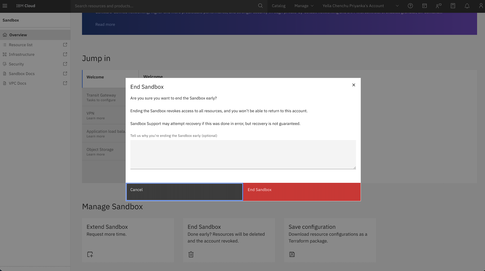

---

copyright:
  years: 2026
lastupdated: "2026-04-20"

keywords:

subcollection: sandbox

content-type: release-note

---

{{site.data.keyword.attribute-definition-list}}

# Provisioning the IBM Cloud Sandbox
{: #deploy}

The solution uses the IBM Cloud Catalog service to ensure a unified and consistent approach.

## Creating the account using UI
{: #create-ui}

1. Navigate to the [IBM Cloud Catalog](https://cloud.ibm.com/catalog#highlights){: external} and search for the **Sandbox** offering.

    {: caption="Sandbox - Catalog page" caption-side="bottom"}

2. In the **Create** tab, provide the following information under **Details**:

    * **Sandbox name** - Name of the sandbox instance.

    * **Region** - Region where the instance is provisioned.

    Only one active sandbox is permitted per allowlisted customer account. Region selection applies only to IAM-based resource restrictions, not sandbox provisioning.
    {: note}

    * **Resource group** - Name from your IBM Cloud account where the VPC resources must be deployed.

    * **Tags** (optional) - Use the tags to organize your resources.

    {: caption="Sandbox - Create" caption-side="bottom"}

3. In the **Users** section, you can invite users from your account to be part of the Sandbox environment. For more information, see [Creating a user](/docs/sandbox?topic=sandbox-create-user).

4. In the **About** tab, you get all the details and overview of the service.

5. In the **Users** section, you can invite users from your account to be part of the Sandbox environment.

6. Accept the terms and conditions, click **Create Sandbox**.

7. Sandbox account is provisioned now. This includes a 14-day trial period with a 48-hour extension. User access is limited to the region selected during provisioning.

    {: caption="Sandbox - Create account" caption-side="bottom"}

8. The Sandbox instance is displayed for provisioning in the **Resource list**.

9. Sandbox account is created for provisioning. This includes a 14-day trial period with a 48-hour extension. User access is limited to the region selected during provisioning.

10. A welcome email is sent and you can successfully log in to the Sandbox account.

11. You will be redirected to the trusted profile by clicking **Continue**.

12. On the main **Sandbox Overview** page, click **Create Resources**.

    You will not be able to change the region once selected during the provisioning.
    {: note}

13. Under **Server Configuration**, select the server instances.

14. Select the image to configure the instances.

    {: caption="Select image - Server instance" caption-side="bottom"}

15. Select the instance profile type.

    {: caption="Select profile - Server instance" caption-side="bottom"}

16. Under **Additional services**, you can enable and customize the services.
    * Cloud Object Storage
    * Load Balancer
    * VPN for VPC
    * Transit Gateway

17. Accept the terms and conditions, click **Create resources**.

18. In the Resource list, you can see all the resources that you have created.

19. On the **Sandbox Overview** page, you can also:

    * **Manage Sandbox** - save the configuration by downloading the Terraform package and running it in your customer account.

    {: caption="Sandbox - Manage" caption-side="bottom"}

    * **Extend Sandbox** - extend the duration of the Sandbox trial environment. The extension is for 48 hours.

    {: caption="Sandbox - Extend" caption-side="bottom"}

    * **End Sandbox** - manually delete the Sandbox environment and all the associated resources.

    {: caption="Sandbox - End" caption-side="bottom"}

## Verify access policies
{: #sandbox-verify-policy}

IBM Cloud® Identity and Access Management (IAM) policies assigned in the sandbox environment for the customer trusted profile.

### IAM policies
{: #iam-policies}

Following is the list of custom IAM Policies assigned to trusted profile:

   | Service | Resources | Roles |
   | ------- | --------- | ---- |
   | All IAM Account Management services | All | Viewer |
   | Cloud Object Storage | All | SandboxCOSRole |
   | Catalog Management | All | Editor |
   | DNS Services | All | Manager, Editor |
   | Resource group only | All resource groups in the account | Editor |
   | Secrets Manager | Region string equals us-east | Manager, Editor, SecretsReader |
   | Transit Gateway | All | Manager, Editor |
   | User Management | All | Viewer |
   | VPC Infrastructure Services | Region string equals us-east |  |
   {: caption="IAM policies" caption-side="bottom"}

### Sandbox IAM policies
{: #sandbox-iam-policies}

Following is the list of IAM policies defined for our Sandbox service:

   | Action | Display name | Roles |
   | ------- | --------- | ---- |
   | sandbox.instance.read | Sandbox Viewer | Administrator, Editor, Operator, Viewer |
   | sandbox.instance.operate | Sandbox Operator | Administrator, Editor, Operator |
   | sandbox.instance.editor | Sandbox Editor | Administrator, Editor |
   | sandbox.instance.admin | Sandbox Administrator | Manager, Administrator |
   {: caption="Sandbox IAM policies" caption-side="bottom"}
