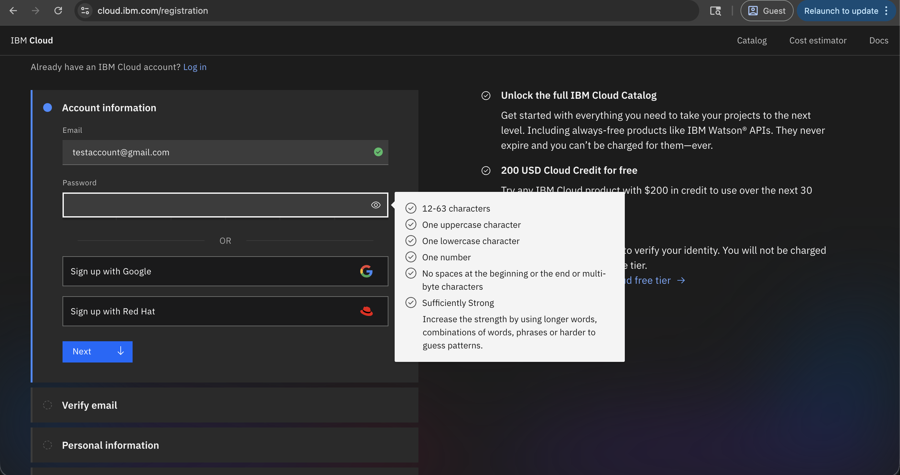

---

copyright:
  years: 2026
lastupdated: "2026-04-20"

keywords:

subcollection: sandbox
content-type: tutorial

---

{{site.data.keyword.attribute-definition-list}}

# Getting Started with IBM Cloud Sandbox
{: #getting-started-sandbox}

The IBM Cloud Sandbox is a secure, scalable, and free-to-use trial environment designed to help customers explore and experience {{site.data.keyword.vpc_short}} and next-generation infrastructure. It helps users understand how the IBM Cloud infrastructure performs, behaves, and scales for their use cases before making production or migration decisions.
{: shortdesc}

It allows users to test, explore, and evaluate their applications or workloads using {{site.data.keyword.vpc_short}} capabilities within a limited trial period of 2 weeks.

The IBM Cloud Sandbox is ideal for:

- **Existing IBM Cloud Classic customers** running workloads on Classic Virtual Server or Bare Metal Server who want to explore VPC features, validate workload compatibility, and prepare for migration to next-generation VPC infrastructure.

- **Existing IBM Cloud users** who require a safe, isolated environment to test VPC configurations, evaluate new compute profiles, or deploy workloads without affecting production environments.

- **New IBM Cloud users** who want hands-on experience with IBM Cloud services, VPC capabilities, deployment models, and the next-generation infrastructure—available free of charge for 14 days before implementation in their own account.

## Before you begin
{: #before-you-begin}

Before you access the IBM Cloud Sandbox, ensure that the following requirements are met:

* You need to have an active IBM Cloud account.
* If you do not have an account, then:

    - Register using the [IBM Cloud account](https://cloud.ibm.com/registration).
    - Enter the email and password. The password requirement should be met.
    - Verify your email address and personal information.
    - Click **Create account**.

    {: caption="Create IBM Cloud account" caption-side="bottom"}

* You have a valid IBMid for authentication.
* You need to know that the sandbox environment has a 14-day trial period.

## Request sandbox access
{: #sandbox-request}
{: step}

1. An email notification is sent to all the allow-listed customers to experience the IBM Cloud Sandbox environment.
2. After clicking **Request**, you will be redirected to IBM Cloud account details page to get started. Update the required information.
3. Accept the terms and conditions.
4. Click **Join** account.

You will receive **Welcome to your IBM Cloud Sandbox** email. Now you are ready to deploy workloads, test configurations, and experience how VPC helps you build secure, scalable cloud environments.

## Access the IBM Cloud Catalog
{: #sandbox-catalog}
{: step}

The IBM Cloud Sandbox is available through the IBM Cloud Catalog.

1. Log in to the [IBM Cloud console](https://cloud.ibm.com){: external}.
2. Navigate to **Catalog** from the top navigation menu.
3. Search for **Cloud Sandbox** or browse the catalog to find the Cloud Sandbox service.
4. Click **Cloud Sandbox** tile to view the service details.

For more information on provisioning, see [Deploying the Sandbox](/docs-draft/sandbox?topic=sandbox-deploy) topic.

## Create your sandbox environment
{: #sandbox-create}
{: step}

1. On the Sandbox provision page, click **Create**.

2. Enter the required details:

   * **Sandbox name** - Provide a unique, descriptive name for your sandbox environment (for example, "sandbox-month-date")

   * **Resource group** - Choose an existing resource group or create a new one to organize your sandbox resources. User should be clear about the region, once selected you cannot change later during provisioning. For more information on creating a new resource group, see

   * **Region** - Select the geographic location where your sandbox resources will be deployed (for example, us-south, eu-de, jp-tok and so on).

   * **Tags** - Use the tags to organize your resources (for example, testing, migration, team-alpha).

   * **Users** - Specify additional users who should have access to collaborate in this sandbox environment (enter IBMids or email addresses).For more information on creating/adding users, see

3. Review the sandbox configuration and trial period information (14 days).

4. Click **Create sandbox** to submit your request.

The sandbox provisioning process typically takes 5-10 minutes. You will receive a notification when your sandbox environment is ready.
{: note}

## Access your sandbox through trusted profile
{: #sandbox-access-profile}
{: step}

After your sandbox is provisioned, you will receive access for the trusted profile.

1. Check your email for the sandbox access notification.

2. Locate your sandbox trusted profile (it will include your sandbox name).

6. Go to Sandbox Overview page

The trusted profile provides secure, time-limited access to your sandbox environment with appropriate IAM permissions. It automatically expires after the 14-day trial period.
{: important}

## Provision resources using Quick Start
{: #sandbox-quickstart}
{: step}

The sandbox environment includes Quick Start options to help you deploy common infrastructure resources.

### Create servers
{: #sandbox-create-servers}

1. From the sandbox landing page, navigate to **Quick Start > Create resources for Sandbox**.

2. Click **Servers (Create VSI/BM)** to provision compute resources:

   * **Virtual Server Instances (VSI)** - Deploy virtual machines with various compute profiles
   * **Bare Metal Servers (BM)** - Provision dedicated physical servers for high-performance workloads

3. Select your preferred server configuration, including:
   - Operating system (Linux distributions, Windows Server)
   - Compute profile (balanced, compute-optimized, memory-optimized)
   - Network configuration
   - Storage volumes

4. Click **Create** to provision your server.

### Deploy additional services
{: #sandbox-additional-services}

Enhance your sandbox environment with additional VPC services:

* **Cloud Object Storage** - Deploy scalable object storage for data, backups, and application content

* **Load Balancer** - Configure load balancers to distribute traffic across multiple server instances for high availability

* **VPN for VPC** - Set up secure VPN connectivity to access your sandbox environment from on-premises networks or remote locations

* **Transit Gateway** - Connect multiple VPCs or integrate with on-premises networks for hybrid cloud scenarios

To deploy any of these services:

1. Navigate to **Quick Start > Additional Services**.
2. Select the service you want to deploy.
3. Configure the service parameters.
4. Click **Create** to provision the service.

## Explore and test VPC capabilities
{: #sandbox-explore}
{: step}

After provisioning resources, use your sandbox environment to explore VPC features and capabilities.

### Test networking features
{: #sandbox-test-networking}

- Configure and test subnets, security groups, and network ACLs
- Set up public and private connectivity
- Test network performance and latency
- Experiment with VPN and Transit Gateway configurations

### Evaluate compute options
{: #sandbox-test-compute}

- Deploy workloads on different instance profiles
- Test application performance and scalability
- Compare VSI and Bare Metal Server capabilities
- Evaluate auto-scaling configurations

### Assess storage solutions
{: #sandbox-test-storage}

- Attach and manage block storage volumes
- Test Cloud Object Storage integration
- Evaluate storage performance for your workloads
- Experiment with backup and snapshot capabilities

### Configure load balancing
{: #sandbox-test-loadbalancing}

- Set up application load balancers
- Test traffic distribution across instances
- Configure health checks and monitoring
- Evaluate high availability scenarios

## Collaborate with team members
{: #sandbox-collaborate}
{: step}

If you added users to the sandbox during creation, they will receive access notifications and can collaborate with you.

To add more users after creation:

1. Navigate to your sandbox environment details.
2. Click **Manage users** or **Add collaborators**.
3. Enter the IBMids or email addresses of additional team members.
4. Specify their access level and permissions.
5. Click **Invite** to send access notifications.

All collaborators share the same 14-day trial period and can view, create, and manage resources within the sandbox environment based on their assigned permissions.

## Monitor your sandbox lifecycle
{: #sandbox-lifecycle}

Your sandbox environment has a 14-day trial period. To track your remaining time:

1. View the trial period countdown on the sandbox landing page.
2. Check your email for reminder notifications (typically sent at 7 days, 3 days, and 1 day before expiry).
3. Review the sandbox details page for expiration date and time.

After the 14-day trial period expires, all resources in the sandbox environment are automatically deleted. Ensure you save any important data or configurations before the expiration date.
{: important}

If you need to extend your evaluation, you can create a new sandbox environment or migrate your workloads to your own IBM Cloud account.

## Next steps
{: #next-steps}

- [Understanding VPC templates](/docs/vpc?topic=vpc-sandbox-templates)
- [Migrating from Classic to VPC](/docs/vpc?topic=vpc-sandbox-migration-guide)
- [VPC networking concepts](/docs/vpc?topic=vpc-about-networking-for-vpc)
- [Managing VPC resources](/docs/vpc?topic=vpc-creating-a-vpc-using-the-ibm-cloud-console)
