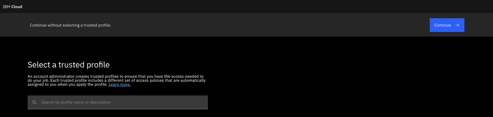

---

copyright:
  years: 2026
lastupdated: "2026-05-06"

keywords:

subcollection: sandbox
content-type: tutorial

---

{{site.data.keyword.attribute-definition-list}}

# Getting Started with {{site.data.keyword.sandbox_full_notm}}
{: #getting-started-sandbox}

The {{site.data.keyword.sandbox_full_notm}} is a secure, scalable, and free-to-use trial environment designed to help customers explore and experience {{site.data.keyword.vpc_short}} and next-generation infrastructure. It helps users understand how the {{site.data.keyword.Bluemix_notm}} infrastructure performs, behaves, and scales for their use cases before making production..
{: shortdesc}

It gives users a 2-week trial to experiment with, test, and assess their applications or workloads using {{site.data.keyword.vpc_short}} features.

The {{site.data.keyword.sandbox_full_notm}} is ideal for:

- **Existing {{site.data.keyword.Bluemix_notm}} Classic customers** running workloads on Classic Virtual Server or Bare Metal Server who want to explore VPC features, validate workload compatibility, and prepare for migration to next-generation VPC infrastructure.

- **Existing {{site.data.keyword.Bluemix_notm}} users** who want hands-on experience with {{site.data.keyword.Bluemix_notm}} services and VPC infrastructure. Users who require a safe, isolated environment to test VPC configurations, evaluate new compute profiles, or deploy workloads without affecting production environments.

To provision the Sandbox service from the {{site.data.keyword.Bluemix_notm}} catalog, the user must have administrator-level permissions to initiate the deployment. Users with minimal permissions cannot provision the service.
{: important}

## Before you begin
{: #before-you-begin}

Before you access the Cloud Sandbox, ensure that the following requirements are met:

* You need to have an active {{site.data.keyword.Bluemix_notm}} account.

* You have a valid IBMid for authentication.

* You will receive **Welcome to your IBM Cloud Sandbox** email. You are all set to deploy the workloads, verify configurations, and experience how VPC helps build secure, scalable cloud solutions.

## Understanding Sandbox boundaries and constraints
{: #sandbox-boundaries}

The Sandbox environment has specific limitations to ensure fair usage and maintain security:

### Service availability
{: #service-availability}

The Sandbox provides access to select {{site.data.keyword.Bluemix_notm}} Infrastructure as a Service (IaaS) offerings, including:

* Virtual Server for VPC and Bare Metal Servers for VPC
* Block Storage and Instance Storage for VPC
* {{site.data.keyword.cos_full_notm}}
* Virtual Private Cloud (VPC) networking components
* Load Balancer, Client VPN, and Transit Gateway
* DNS and Secrets Manager

Other {{site.data.keyword.Bluemix_notm}} services outside of these IaaS offerings are not available in the Sandbox environment.

### Resource constraints
{: #resource-constraints}

The Sandbox enforces quota limits on compute, network, and storage resources to ensure optimal performance and fair usage. Key constraints include:

* **Compute**: Limited vCPU (128) and RAM (1028 GB) for Virtual Servers, and 1 Bare Metal Server
* **Storage**: Block Storage limited to 4096 GB per VSI, Instance Storage to 1024 GB, and {{site.data.keyword.cos_full_notm}} to 4096 GB
* **Network**: Maximum of 2 VPCs, 4 subnets, 4 Floating IPs, and 10 security groups
* **Services**: 1 instance each for Load Balancer, VPN, Transit Gateway, DNS, and Secrets Manager

For more details on quota limits, see [Sandbox quota limits](/docs/sandbox?topic=sandbox-sandbox-quota).

### Terms and conditions
{: #terms-conditions}

By using the Sandbox, you agree to:

* Use the environment for evaluation and testing purposes only, not for production workloads
* Follow security best practices and usage guidelines as outlined in [Limitations](/docs/sandbox?topic=sandbox-limitation)
* Accept that all resources will be automatically deleted after the 14-day trial period expires
* Comply with {{site.data.keyword.Bluemix_notm}} terms of service and acceptable use policies

## Creating Sandbox account
{: #sandbox-request}
{: step}

1. An email notification is sent to all the allow-listed customers to experience the Cloud Sandbox environment.
2. After clicking **Request**, you will be redirected to the Sandbox provisioning page to get started. Update the required information.

## Accessing the IBM Cloud Catalog
{: #sandbox-catalog}
{: step}

After clicking **Request** in the email notification, you will be redirected to the Sandbox provisioning page. If you need to access it later, go directly to the [Cloud Sandbox provisioning page](https://cloud.ibm.com/catalog/services/cloud-sandbox){: external}.

For more information on provisioning, see [Provisioning the {{site.data.keyword.sandbox_full_notm}}](/docs-draft/sandbox?topic=sandbox-deploy) topic.

## Creating your Sandbox environment
{: #sandbox-create}
{: step}

Only users with **administrator** access in the Cloud Sandbox are authorized to create Sandbox accounts.
{: important}

Perform the following steps to provision the Sandbox:

1. On the Sandbox provision page, enter the required details:

   * **Sandbox name** - Provide a unique, descriptive name for your Sandbox environment (for example, "sandbox-month-date")

   * **Resource group** - Choose an existing resource group or create a new one to organize your sandbox resources. For more information on creating a new resource group, see [Creating a resource group](/docs/sandbox?topic=sandbox-create-resource-group).

   * **Region** - Select the geographic location where your Sandbox resources will be provisioned (for example, us-south, eu-de and so on).

   The region cannot be changed after provisioning, and all resources will be created in the selected region.
   {: note}

   * *Optional*: Enter tags to help you organize and find your resources. You can add more tags later. For more information, see [Working with tags](/docs/account?topic=account-tag&interface=ui).

   * **Users** - Select the users who will have access to Sandbox. All users are granted the same access level and permissions. For more information on creating/adding users, see [Managing user access for Sandbox](/docs/sandbox?topic=sandbox-manage-user-access-sandbox).

    Users can be added only during the initial provisioning page, not during resource creation. Once users are added to a Sandbox account at the time of creation, they remain unchanged until the trial ends. No modifications can be made later, and the roles assigned to them at creation time also remain the same throughout the trial period.
    {: important}

2. Click **Create sandbox** to submit your request. The Sandbox provisioning process typically takes 5-10 minutes. You will receive an email when it is ready, or you can refresh and check the **Resource List** to see the instance.

3. After the Sandbox is created you can find them listed in the resource list of your account. You can edit the name, manage tags, or delete the Sandbox and all associated resources.

Only one Sandbox creation is allowed per allow-listed customer account.
{: tip}

## Accessing your Sandbox through email
{: #sandbox-access-profile}
{: step}

After your Sandbox is provisioned, an email is sent to all users with access details and supporting links to explore the Sandbox environment.

1. In the email, click the **Access the link and explore the Sandbox** link to open the Sandbox environment.

2. When prompted, provide your {{site.data.keyword.Bluemix_notm}} credentials to authenticate.

3. If two-factor authentication is enabled on your account, complete the verification process by providing the required authentication code.

4. After successful authentication, you are redirected to the Sandbox trusted profile page.

    {: caption="Select a trusted profile" caption-side="bottom"}

5. If the Sandbox account is not visible on the account page, select the trusted profile from the account drop-down menu. The trusted profile is labeled with the tag `sandbox expires mm/dd`.

6. After switching to the trusted profile, you are navigated to the Sandbox trusted profile account.

7. Access the [Sandbox Overview page](https://cloud.ibm.com/sandbox/overview){: external} (which is quickstart) to begin creating resources and exploring VPC capabilities.

The trusted profile provides secure, time-limited access to your Sandbox environment with appropriate IAM permissions. It automatically expires after the 14-day trial period.
{: important}

## Provisioning resources
{: #sandbox-create-resources}
{: step}

In the Sandbox environment, you can create the resources from the Overview page.For more information, see [Creating resources in Sandbox](/docs/sandbox?topic=sandbox-quickstart) topic.

## Exploring VPC capabilities
{: #sandbox-explore}
{: step}

After provisioning resources, use your Sandbox environment to explore VPC features and capabilities.

### Testing network features
{: #sandbox-test-networking}

Configure and validate network components by setting up the subnets, security groups, and network ACLs. Establish the public and private connectivity by testing latency and performance and experimenting with VPN and Transit Gateway configurations.

* For more information on transit gateway, see [Creating a Transit Gateway](/docs/sandbox?topic=sandbox-connect-migrate#create-transit-gateway).
* For more information on subnets, see [Working with subnets](/docs/vpc?topic=vpc-subnets-configure&interface=ui).
* For more information on network ACL, see [Creating a network ACL](/docs/vpc?topic=vpc-acl-create-ui&interface=ui).
* For more information on security group, see [Setting up a security group for your resource](/docs/vpc?topic=vpc-configuring-the-security-group&interface=ui).

### Evaluating compute options
{: #sandbox-test-compute}

Deploy and compare workloads across different compute profiles to evaluating the performance, scalability, bare metal versus VSI capabilities, and auto-scaling behavior.

For more information on bare metal, see [Creating Bare Metal Servers on VPC](/docs/vpc?topic=vpc-creating-bare-metal-servers&interface=ui).

### Accessing storage solutions
{: #sandbox-test-storage}

Manage and evaluate storage by attaching block volumes, integrating {{site.data.keyword.cos_full_notm}} (COS), and testing performance.

For more information on block volumes, see [Creating Block Storage for VPC volumes](/docs/vpc?topic=vpc-creating-block-storage&interface=ui).

### Configuring load balancing
{: #sandbox-test-loadbalancing}

Configure and test application load balancing by distributing traffic across instances, setting up health checks and monitoring, and validating high availability scenarios.

For more information on load balancer, see [Creating an application load balancer](/docs/vpc?topic=vpc-load-balancers&interface=ui).

## Monitor your sandbox lifecycle
{: #sandbox-lifecycle}

Your Sandbox environment has a 14-day trial period. To track your remaining time:

1. View the trial period countdown on the Sandbox landing page.

2. Check your email for reminder notifications (typically sent at 7 days, 3 days, and 1 day before expiry).

After the 14-day trial period expires, all resources in the Sandbox environment are automatically deleted. You must save the configuration by downloading the Terraform package and running it in your own customer account.
{: important}

## Learn more
{: #next-steps}

- [VPC networking concepts](/docs/vpc?topic=vpc-about-networking-for-vpc)
- [Managing VPC resources](/docs/vpc?topic=vpc-creating-a-vpc-using-the-ibm-cloud-console)
