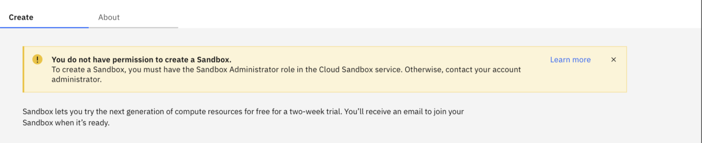

---

copyright:
  years: 2022, 2023
lastupdated: "2026-05-05"

keywords:

subcollection: sandbox

---

{{site.data.keyword.attribute-definition-list}}

# Managing user access for Sandbox
{: #manage-user-access-sandbox}

Manage user access for {{site.data.keyword.sandbox_full_notm}} by adding Cloud Sandbox permissions to existing users or inviting new users with the required access.
{: shortdesc}

## Before you begin
{: #before-you-begin}
* Ensure that you have the required permissions to manage users in your account.

{: caption="Permission for provision" caption-side="bottom"}

## Adding Cloud Sandbox permission to existing users to provision sandbox
{: #add-sandbox-permission}

To add Cloud Sandbox permission to existing users in your account, follow these steps:

1. In the {{site.data.keyword.Bluemix_notm}} console, **select Manage** > **Access (IAM)**.

2. In the *IAM navigation* menu, select **Users**.

3. Find the user you want to grant access to.

4. Select **Access policy**.

5. Add **Cloud Sandbox** permission.

6. Click **Next**.

7. Select **Roles and Action** and assign **Administrator** as the platform access to the user. Click **Review**.

8. Click **Finish**.

## Creating or inviting a user and add Cloud Sandbox permission
{: #invite-user-sandbox}

To create or invite a new user and grant them Cloud Sandbox permission, follow these steps:

1. In the {{site.data.keyword.Bluemix_notm}} console, **select Manage** > **Access (IAM)**.

2. In the *IAM navigation* menu, select **Users**.

3. Click **Invite** users.

4. Enter the email addresses.

5. Select **Access policy**. Ensure that you add access policies and grant administrator-level access to the following services:

    * All Identity and Access–enabled services
    * All Account Management services
    * Cloud Sandbox

6. Click **Next**.

7. Select **Roles and Action** and assign **Administrator** as the platform access to the user. Click **Review**.

8. To add this level of access for these users, click **Add**. It will be added to the summary panel. You can add additional access policies if desired, or click **Invite** to send email invitations.

9. On the right-hand side, click **Invite**.

The user gets an email invitation with the link to complete the process. This will add the user in the User list and to the Sandbox provisioning page.

{: caption="Creating a user" caption-side="bottom"}
