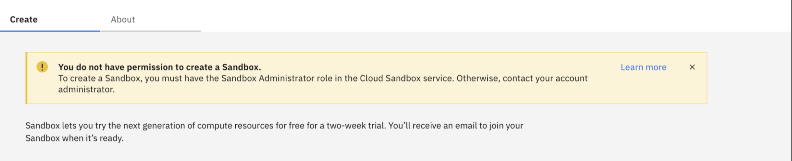

---

copyright:
  years: 2026
lastupdated: "2026-05-14"

keywords:

subcollection: sandbox

---

{{site.data.keyword.attribute-definition-list}}

# IAM Permissions
{: #manage-user-access-sandbox}

Manage user access for {{site.data.keyword.sandbox_full_notm}} by adding Cloud Sandbox permissions to existing users or inviting new users with the required access.
{: shortdesc}

## Before you begin
{: #before-you-begin}

* Before you provision the IBM Cloud Sandbox, ensure that you have Administrator access to Identity and Access Management (IAM) in your IBM Cloud account.

* If the required permissions are not added, you cannot provision the Sandbox, and an error message will be displayed on the catalog tile.

{: caption="Permission for provision" caption-side="bottom"}

## Administrator Permissions for Cloud Sandbox
{: admin-permissions}

Cloud Sandbox provisioning and management require appropriate **Identity and Access Management (IAM)** permissions in IBM Cloud. These permissions determine whether a user can manage account-level settings, administer IAM policies, and provision Cloud Sandbox environments.

### Required Administrator Permissions
{: #reqd-permission}

To provision and manage Cloud Sandbox environments, the following administrator permissions are required:

* All Identity and Access enabled services
* All Account Management services

These permissions are automatically assigned to the IBM Cloud account owner and provide the necessary access to manage Cloud Sandbox services and resource groups.

## Access Models
{: #access}

Administrators can provide either full administrative privileges or limited Cloud Sandbox access to other users, depending on the level of control they need.

### Full Administrator Access
{: #full-access}

Users with full administrator access can manage all account and IAM-related operations, including:

* Managing IAM policies and access controls
* Configuring account-level settings
* Inviting and managing users
* Assigning roles and permissions
* Provisioning and managing Cloud Sandbox environments
* Managing resource groups and related resources

To grant full administrator access, assign the following permissions:

* All Identity and Access enabled services
* All Account Management services

This access level provides administrative privileges equivalent to those of the account owner.
{: note}

### Limited Cloud Sandbox Access
{: #limited-access}

For users who only require access to provision and manage Cloud Sandbox environments, administrators can assign a more restricted set of permissions.

To grant limited access, assign the following permissions:

* Cloud Sandbox permissions
* Resource group permissions

With this access model, users can provision and manage Sandbox environments within the assigned scope. However, they cannot:

* Modify IAM policies
* Manage account-level configurations
* Invite or manage users
* Assign permissions to other users

This approach allows organizations to maintain centralized administrative control while enabling users to work with Cloud Sandbox resources.

## Best Practices
{: best-prac}

Following are the best practices when assigning permissions:

* Grant full administrator access only to users who require complete account management capabilities.
* Use limited Cloud Sandbox access for users who only need to provision and manage Sandbox environments.
* Apply the principle of least privilege by assigning only the permissions required for a users responsibilities.
* Periodically review and audit user permissions to ensure continued security and compliance.

## Adding permissions to existing users to provision Sandbox
{: #add-sandbox-permission}

To add Cloud Sandbox permission to existing users in your account, follow these steps:

1. In the {{site.data.keyword.Bluemix_notm}} console, **select Manage** > **Access (IAM)**.

2. In the *IAM navigation* menu, select **Users**.

3. Find the user you want to grant access to.

4. Select **Access policy**.

5. Add **Cloud Sandbox** permission. For more information, see [Administrator Permissions for Cloud Sandbox](/docs/sandbox?topic=sandbox-manage-user-access-sandbox#administrator-permissions-for-cloud-sandbox).

6. Click **Next**.

7. Select **Roles and Action** and assign **Administrator** as the platform access to the user. Click **Review**.

8. Click **Finish**.

## Creating or inviting a user and add Cloud Sandbox permission
{: #invite-user-sandbox}

To create or invite a new user and grant them Cloud Sandbox permission, follow these steps:

1. In the {{site.data.keyword.Bluemix_notm}} console, **select Manage** > **Access (IAM)**.

2. In the *IAM navigation* menu, select **Users**.

3. Click **Invite** users.

4. Enter the email addresses.

5. Select **Access policy**. Ensure that you add access policies and grant administrator-level access to the following services. For more information, see [Administrator Permissions for Cloud Sandbox](/docs/sandbox?topic=sandbox-manage-user-access-sandbox#administrator-permissions-for-cloud-sandbox).

6. Click **Next**.

7. Select **Roles and Action** and assign **Administrator** as the platform access to the user. Click **Review**.

8. To add this level of access for these users, click **Add**. It will be added to the summary panel. You can add additional access policies if desired, or click **Invite** to send email invitations.

9. On the right-hand side, click **Invite**.

The user gets an email invitation with the link to complete the process. This will add the user in the User list and to the Sandbox provisioning page.
