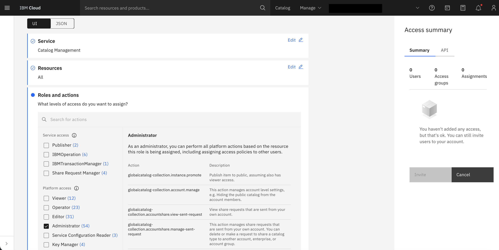

---

copyright:
  years: 2026
lastupdated: "2026-05-14"

keywords:

subcollection: sandbox

---

{{site.data.keyword.attribute-definition-list}}

# IAM Permissions
{: #manage-user-access-sandbox}

Manage user access for {{site.data.keyword.sandbox_full_notm}} by adding Cloud Sandbox permissions to existing users or inviting new users with the required access.
{: shortdesc}

## Before you begin
{: #before-you-begin}

* Before you access the IBM Cloud Sandbox, ensure that you have Administrator access to Identity and Access Management (IAM) in your IBM Cloud account.

* If the required permissions are not added, you cannot provision the Sandbox, and an error message will be displayed on the catalog tile.

{: caption="Permission for provision" caption-side="bottom"}

## Administrator permissions
{: admin-permissions}

### Scenario 1
{: #scenario1}

As an administrator, you must have the two default permissions:

* All Identity and Access enabled services
* All Account Management services.
    
These permissions are automatically assigned to the user who creates an IBM Cloud account. With these privileges, you can also invite users to your account.

### Scenario 2
{: #scenario2}

If you already have administrator permissions, then you can directly create a Sandbox. However, you need the **Cloud Sandbox** and a **Resource group only** permissions. These permissions are covered by the All Identity and Access enabled services and All Account Management services.

### Scenario 3
{: #scenario3}

As an administrator, if you want to allow other users to join or provision the Cloud Sandbox, then you have two options:

* You can grant the **Administrator** access to other user by assigning **All Identity and Access enabled services** and **All Account Management services** permissions. This will ensure that the allowed user is also an admin with the same administrative privileges. 
    
* Or, if you want to retain the admin control by allowing the user to only provision the Sandbox then you can assign **Cloud Sandbox** and **Resource group only** specific permissions to the user. In that case, the user can only provision the Sandbox but cannot do any IAM or account level changes.

* The added Admin can invite new users and grant them **Cloud Sandbox** permissions, allowing them to provision the Sandbox.

* This permission level is required to invite users, assign access policies, and provision Cloud Sandbox permissions. 

## Adding permissions to existing users to provision Sandbox
{: #add-sandbox-permission}

To add Cloud Sandbox permission to existing users in your account, follow these steps:

1. In the {{site.data.keyword.Bluemix_notm}} console, **select Manage** > **Access (IAM)**.

2. In the *IAM navigation* menu, select **Users**.

3. Find the user you want to grant access to.

4. Select **Access policy**.

5. Add **Cloud Sandbox** permission.

6. Click **Next**.

7. Select **Roles and Action** and assign **Administrator** as the platform access to the user. Click **Review**.

8. Click **Finish**.

## Creating or inviting a user and add Cloud Sandbox permission
{: #invite-user-sandbox}

To create or invite a new user and grant them Cloud Sandbox permission, follow these steps:

1. In the {{site.data.keyword.Bluemix_notm}} console, **select Manage** > **Access (IAM)**.

2. In the *IAM navigation* menu, select **Users**.

3. Click **Invite** users.

4. Enter the email addresses.

5. Select **Access policy**. Ensure that you add access policies and grant administrator-level access to the following services:

    * All Identity and Access enabled services
    * All Account Management services

    For more information, see [Administrator permissions](/docs/sandbox?topic=sandbox-manage-user-access-sandbox#administrator-permissions).

6. Click **Next**.

7. Select **Roles and Action** and assign **Administrator** as the platform access to the user. Click **Review**.

8. To add this level of access for these users, click **Add**. It will be added to the summary panel. You can add additional access policies if desired, or click **Invite** to send email invitations.

9. On the right-hand side, click **Invite**.

The user gets an email invitation with the link to complete the process. This will add the user in the User list and to the Sandbox provisioning page.

{: caption="Creating a user" caption-side="bottom"}
