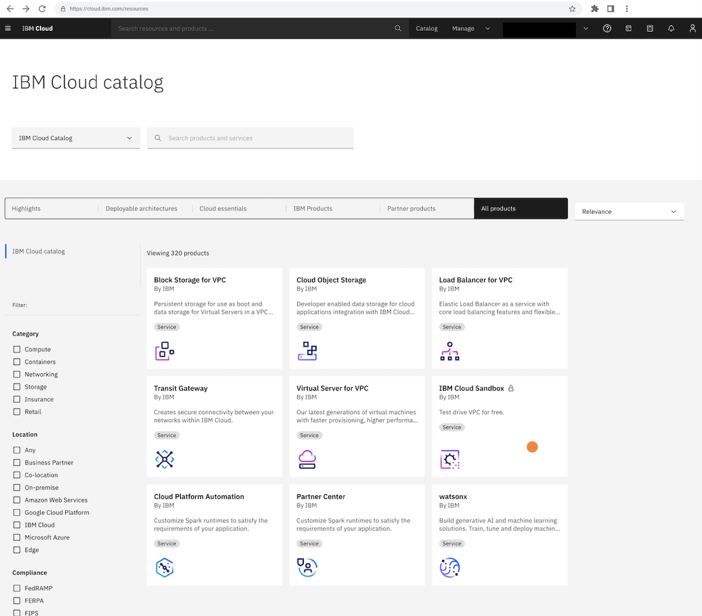
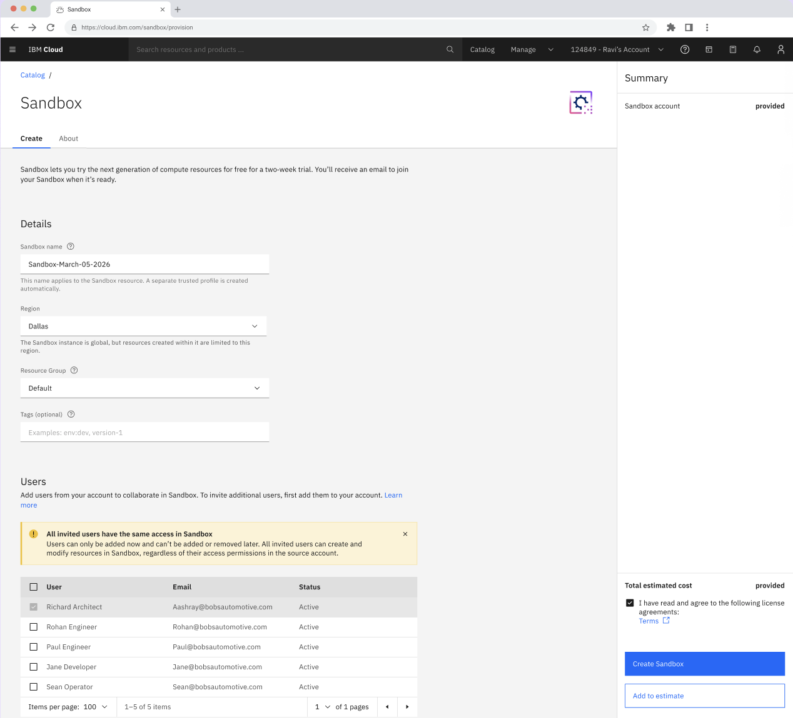
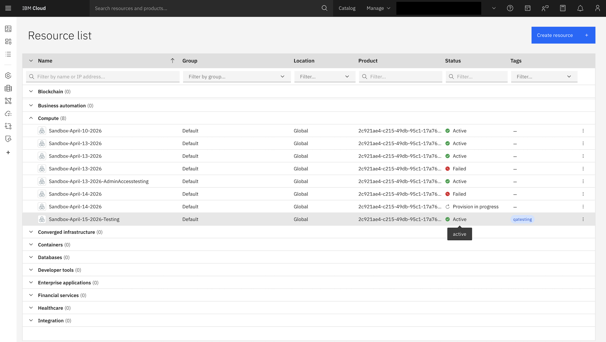

---

copyright:
  years: 2026
lastupdated: "2026-05-04"

keywords:

subcollection: sandbox

content-type: release-note

---

{{site.data.keyword.attribute-definition-list}}

# Provisioning the {{site.data.keyword.sandbox_full_notm}}
{: #deploy}

The solution uses the {{site.data.keyword.Bluemix_notm}} Catalog service to ensure a unified and consistent approach.

## Creating the account using UI
{: #create-ui}

Only one sandbox is allowed per allowlisted customer account.
{: note}

1. Navigate to the [{{site.data.keyword.Bluemix_notm}} catalog](https://cloud.ibm.com/catalog#highlights){: external} and search for the **Sandbox** offering.

    {: caption="Sandbox - Catalog page" caption-side="bottom"}

2. In the **Create** tab, provide the following information under **Details**:

    * **Sandbox name** - Name of the sandbox instance.

    * **Region** - Region where the instance is provisioned.

    You will not be able to change the region once selected during the provisioning.
    {: note}

    * **Resource group** - Name from your {{site.data.keyword.Bluemix_notm}} account where the Sandbox resource will be deployed.

    * **Tags** (optional) - Use the tags to organize your resources.

    {: caption="Sandbox - Create" caption-side="bottom"}

3. In the **Users** section, you can select users from your account. For more information, see [Creating a user](/docs/sandbox?topic=sandbox-create-user).

4. Accept the terms and conditions, click **Create Sandbox**.

Sandbox account is provisioned now. This includes a 14-day trial period with a 2 days (48 hours) extension. User access is limited to the region selected during provisioning.

## Accessing Sandbox
{: #access-sandbox}

The Sandbox instance is displayed in the Resource list. To access the Sandbox environment:

1. Click on the Sandbox instance name in the **Resource list**.

2. Select the trusted profile in the account switcher.

3. Click on the link in the welcome email.

    {: caption="Sandbox - Resource list" caption-side="bottom"}

## Creating resources in the Sandbox environment
{: #create-resources-sb}

You can create virtual servers or bare metal servers along with other VPC services.

1. On the **Sandbox Overview** page, click **Create resources**.

2. To select from all the available images, click **Change image**. To select from all the available profiles, click **Change profile**.

3. Under **Additional services**, you can enable and customize the services.

    * {{site.data.keyword.cos_full_notm}}
    * Load Balancer
    * VPN for VPC
    * Transit Gateway

4. Accept the terms and conditions, click **Create resources**.

Once resources hss been created, you can view them from the **Resource list**.

## Additional offerings
{: #sandbox-additional-offerings}

### {{site.data.keyword.cos_full_notm}}
{: #cos}

A highly scalable and durable storage solution designed for unstructured data. You can use this service to:

* Store and retrieve large amounts of data such as images, videos, documents, and backups.
* Archive data for long-term retention with cost-effective storage tiers.

You can create a {{site.data.keyword.cos_full_notm}} (COS) instance either from the **{{site.data.keyword.Bluemix_notm}} UI** or through the **Sandbox Overview** page.

1. **{{site.data.keyword.Bluemix_notm}} UI** - Refer [Creating a service instance](/docs/cloud-object-storage?topic=cloud-object-storage-provision#provision-instance) topic.

2. **Sandbox Overview** page: All steps remain the same mentioned in [Creating a service instance](/docs/cloud-object-storage?topic=cloud-object-storage-provision#provision-instance) topic, but when selecting a resource group, you can either choose Default or any available resource group.

The supported capacity for {{site.data.keyword.cos_full_notm}} for Sandbox is 1 instance.

#### Learn more
{: #learnmore-cos}

* [Getting started with {{site.data.keyword.cos_full_notm}}](/docs/cloud-object-storage?topic=cloud-object-storage-getting-started-cloud-object-storage)

* [Creating a bucket on COS](/docs/cloud-object-storage?topic=cloud-object-storage-secure-content-store#create-cos-bucket-step)

* [Choosing a plan and creating an instance](/docs/cloud-object-storage?topic=cloud-object-storage-provision)

* [Deleting a service instance](/docs/cloud-object-storage?topic=cloud-object-storage-provision#delete-instance)

### Load Balancer
{: #lb}

An intelligent traffic distribution service that improves application availability and performance. You can use this service to:

* Distribute incoming traffic across multiple servers to avoid overloading any single one.

* Improve response times by directing users to the nearest or least-loaded server.

You can create a load balancer either from the **{{site.data.keyword.Bluemix_notm}} UI** or through the **Sandbox Overview** page.

1. **{{site.data.keyword.Bluemix_notm}} UI** - Refer [Creating a load balancer](/docs/loadbalancer-service?topic=loadbalancer-service-configuring-ibm-cloud-load-balancer-basic-parameters) topic.

2. **Sandbox Overview** page: All steps remain the same mentioned in [Creating a load balancer](/docs/loadbalancer-service?topic=loadbalancer-service-configuring-ibm-cloud-load-balancer-basic-parameters) topic, but when selecting a resource group, you can either choose Default or any available resource group.

The supported capacity for Load Balancer for Sandbox is 1.

#### Learn more
{: #learnmore-lb}

* [About IBM Cloud Load Balancer](/docs/loadbalancer-service?topic=loadbalancer-service-about-ibm-cloud-load-balancer)

* [Load balancer basics](/docs/loadbalancer-service?topic=loadbalancer-service-ibm-cloud-load-balancer-basics)

* [Exploring IBM Cloud load balancers](/docs/loadbalancer-service?topic=loadbalancer-service-explore)

* [Logging for IBM Cloud Load Balancer](/docs/loadbalancer-service?topic=loadbalancer-service-ibm-cloud-logging)

### VPN for VPC
{: #vpn-vpc}

A secure Virtual Private Network solution that provides encrypted connectivity to your Virtual Private Cloud environment. You can use this service to:

* Establish secure, encrypted connections from your on-premises network or remote locations to your VPC resources.

* Access private resources in your Sandbox environment without exposing them to the public.

* Enable remote team members to access sandbox resources safely.

You can create a load balancer either from the **{{site.data.keyword.Bluemix_notm}} UI** or through the **Sandbox Overview** page.

1. **{{site.data.keyword.Bluemix_notm}} UI** - Refer [Setting up VPC VPN connectivity](/docs/containers?topic=containers-vpc-vpnaas) topic.

2. **Sandbox Overview** page: All steps remain the same mentioned in [Setting up VPC VPN connectivity](/docs/containers?topic=containers-vpc-vpnaas) topic, but when selecting a resource group, you can either choose Default or any available resource group.

The supported capacity for VPN for VPC for Sandbox is 1 instance.

By default, the VPN mode selected is `Split-tunnel`. For more information, see [Split tunnel](https://cloud.ibm.com/docs/vpc?topic=vpc-client-to-site-vpn-planning#full-versus-split-tunnels).
{: important}

#### Learn more
{: #learnmore-vpn}

* [VPNs for VPC overview](/docs/vpc?topic=vpc-vpn-overview)

* [About site-to-site VPN gateways](/docs/vpc?topic=vpc-using-vpn)

* [About client-to-site VPN servers](/docs/vpc?topic=vpc-vpn-client-to-site-overview)

### Transit Gateway
{: #tg}

A centralized network hub that simplifies connectivity between different network environments. You can use this service to:

* Seamlessly connect Classic Infrastructure and VPC resources within your Sandbox.

* Scale your network connections as your Sandbox environment grows.

You can create a load balancer either from the **{{site.data.keyword.Bluemix_notm}} UI** or through the **Sandbox Overview** page.

1. **{{site.data.keyword.Bluemix_notm}} UI** - Refer [Creating a transit gateway](/docs/transit-gateway?topic=transit-gateway-ordering-transit-gateway&interface=ui) topic.

2. **Sandbox Overview** page: All steps remain the same mentioned in [Creating a transit gateway](/docs/transit-gateway?topic=transit-gateway-ordering-transit-gateway&interface=ui) topic, but when selecting a resource group, you can either choose Default or any available resource group.

The supported capacity for Transit Gateway for Sandbox is 1.

#### Learn more
{: #learnmore-tg}

* [Getting started with IBM Cloud Transit Gateway](/docs/transit-gateway?topic=transit-gateway-getting-started&interface=ui)

* [Planning for IBM Cloud Transit Gateway](/docs/transit-gateway?topic=transit-gateway-helpful-tips&interface=ui)

* [Adding a connection](/docs/transit-gateway?topic=transit-gateway-adding-connections&interface=ui)

* [Editing a connection](/docs/transit-gateway?topic=transit-gateway-editing-connections&interface=ui)

* [Deleting a connection](/docs/transit-gateway?topic=transit-gateway-deleting-connections&interface=ui)

* [Deleting a transit gateway](/docs/transit-gateway?topic=transit-gateway-delete-gateway&interface=ui)

For more information on Sandbox quota limits see [here](/docs/sandbox?topic=sandbox-sandbox-quota).

## Supported actions
{: #actions-sb}

Following are the supported actions available on the **Sandbox Oveview** page:

* Extend the Sandbox trial
* End the Sandbox early
* Save the configuration

### Extending Sandbox
{: #extend-sb}

You can optionally extend the Sandbox trial for 2 days (48 hours) by clicking on **Extend Sandbox**. You will get an email confirming extension was granted and the countdown banner will increase by 2 days.

### End Sandbox
{: #end-sb}

You can optionally end the Sandbox trial any time by clicking **End Sandbox**. If you do so, the account will be suspended and you will not be able to access the resources you have created.

It is recommended to save the configuration, so that you can easily replicate your setup in your own account.
{: tip}

### Save configuration
{: #save-config-sb}

The Sandbox environment configuration can be downloaded as a Terraform packaging by clicking on **Save configuration**. For more information, see [Save configuration](/docs-draft/sandbox?topic=sandbox-save-config) topic.
