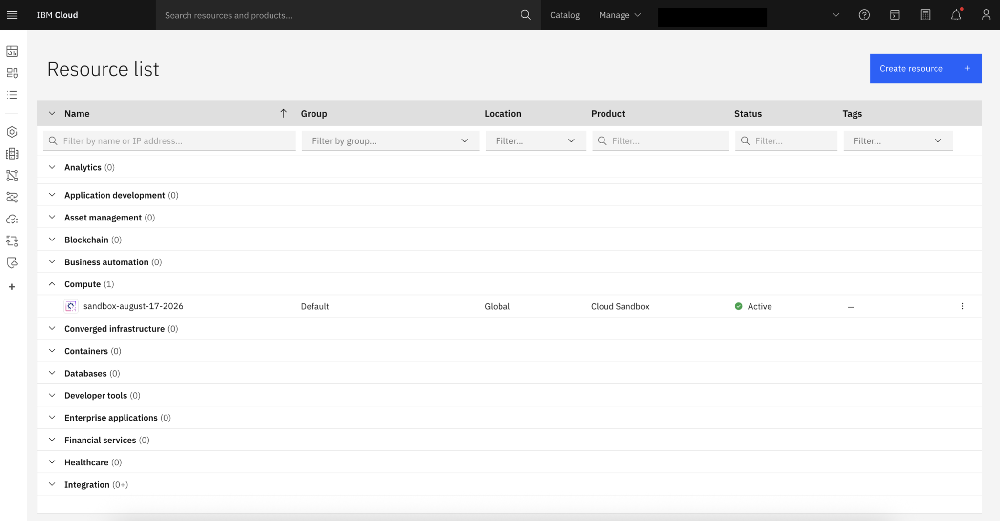

---

copyright:
  years: 2026
lastupdated: "2026-09-02"

keywords:

subcollection: sandbox

content-type: release-note

---

{{site.data.keyword.attribute-definition-list}}

# Provisioning the Cloud Sandbox
{: #deploy}

Provision IBM Cloud Sandbox to quickly create a secure, isolated environment for exploring IBM Cloud VPC services, where you can configure your Sandbox environment, invite users, and begin provisioning resources for testing and evaluation.
{: shortdesc}

## Pre-requisites
{: #pre-requisites}

Ensure that you add access policies and grant administrator-level access to the following services:

* All Identity and Access–enabled services
* All Account Management services
* Cloud Sandbox
* Resource Group

You need the Cloud Sandbox access along with the required Resource Group access to create the Sandbox.
{: note}

Bare metal is subjected to capacity validation.
{: important}

## Creating a Cloud Sandbox instance
{: #create-ui}

Only one Cloud Sandbox is allowed per allowlisted customer account.
{: note}

1. Navigate to the [{{site.data.keyword.Bluemix_notm}} catalog](https://cloud.ibm.com/catalog#highlights){: external} and search for the **Sandbox** offering.

    {: caption="Sandbox - Catalog page" caption-side="bottom"}

2. In the **Create** tab, provide the following information under **Details**:

    * **Sandbox name** - Name of the Cloud Sandbox instance.

    * **Region** - Region where the instance is provisioned.

    You will not be able to change the region once selected during the provisioning.
    {: note}

    * **Resource group** - Name of the resource group from your {{site.data.keyword.Bluemix_notm}} account where the Cloud Sandbox resource is deployed.

    * **Tags** (optional) - Use tags to organize your resources.

    {: caption="Sandbox - Create" caption-side="bottom"}

3. In the **Users** section, select users from your account.

4. Accept the terms and conditions, then click **Create Sandbox**.

The Sandbox account is now provisioned. This includes a 14-day trial period with a 2-day (48-hour) extension. User access is limited to the region selected during provisioning.

A user can create up to three Cloud Sandbox environments per year. Only one Sandbox can be active at any given time.
{: note}

## Accessing Cloud Sandbox
{: #access-sandbox}

The Sandbox instance is displayed in the Resource list. To access the Cloud Sandbox environment:

1. Click on the Cloud Sandbox instance name in the **Resource list**.

    {: caption="Sandbox - Resource list" caption-side="bottom"}

2. On the **user management** page:
    
    - Click **Launch Sandbox** to provision the required resources.
    - From the **Actions** drop-down, you can: 

        * **View docs** - Explore the Cloud Sandbox documentation.
        * **Extend** - Extend the Sandbox trial by 2 days (48 hours).
        * **End** - End the Sandbox trial early.

    - Under the **Users** section, you can add new users or remove the existing users.

        Data is securely stored in a Cloud Object Storage (COS) bucket with object lock enabled. Save the configuration so that you can replicate your setup in your own account.
        {: important}

        To reclaim the Cloud Sandbox account during the trial period, contact the Sandbox team.
        {: tip}

    For additional information, use the **Helpful Links** section to access **Documentation**, **Videos**, and **Feedback resources**.

3. Click on the link in the welcome email.

## Creating resources in the Cloud Sandbox environment
{: #create-resources-sb}

You can create virtual servers or bare metal servers along with other VPC services.

1. On the **Sandbox Overview** page, click **Create resources**.

2. Under **Server configuration**, click **Create a SSH key** to create a SSH key to access the server.

    Following are the requirements when working with the SSH keys:

    * You can select one or more existing SSH keys from those available in the Cloud Sandbox account.
    * Selecting at least one SSH key is required when creating a Virtual Server Instance (VSI).
    * The chosen SSH key(s) must be associated with the VSI during the provisioning process.
    * When a new SSH key is created, download the corresponding private key.
    * Authorized Cloud Sandbox users can share the downloaded private key with other authorized users who require SSH access to the VSI.
    * Users cannot establish an SSH connection to the VSI without the corresponding private SSH key.
    * Non-VSI services can be provisioned without an SSH key.

    For more information on creating SSH key, see [Getting started with SSH keys](/docs/vpc?topic=vpc-ssh-keys&locale=en&interface=ui).

3. To select from all the available images, click **Change image**. To select from all the available profiles, click **Change profile**.

4. Under **Additional services**, you can enable and customize the services.

    * {{site.data.keyword.cos_full_notm}}
    * Load Balancer
    * VPN for VPC
    * Transit Gateway

    {: caption="Sandbox - Create resources" caption-side="bottom"}

5. Accept the terms and conditions, click **Create resources**.

Once resources have been created, you can view them from the **Resource list**.

## Supported actions
{: #actions-sb}

Following are the supported actions available on the **Sandbox Overview** page:

* Extend the Cloud Sandbox trial
* Explore the video tutorials
* Save the configuration

### Extending Cloud Sandbox
{: #extend-sb}

You can optionally extend the Cloud Sandbox trial for 2 days (48 hours) by clicking on **Extend Sandbox**. You will get an email confirming extension was granted and the countdown banner will increase by 2 days.

Users can create up to three Cloud Sandboxes per year, with only one active Sandbox allowed at any given time.
{: important}

The 21-day cooling period begins on the date the Cloud Sandbox is terminated, regardless of whether it ends normally or is ended early by the user. A new Cloud Sandbox can be created only after the cooling period has been completed.
{: important}

### Videos
{: #video-sb}

You can explore the video tutorials to learn more about the Cloud Sandbox features and perform common the administrative tasks. Click on **Videos** to access the [Sandbox Video Tutorials](/docs/sandbox?topic=sandbox-sandbox-feature-video) page.

### Save configuration
{: #save-config-sb}

The Cloud Sandbox environment configuration can be downloaded as a Terraform packaging by clicking on **Save configuration**. For more information, see [Save configuration](/docs/sandbox?topic=sandbox-save-config) topic.
