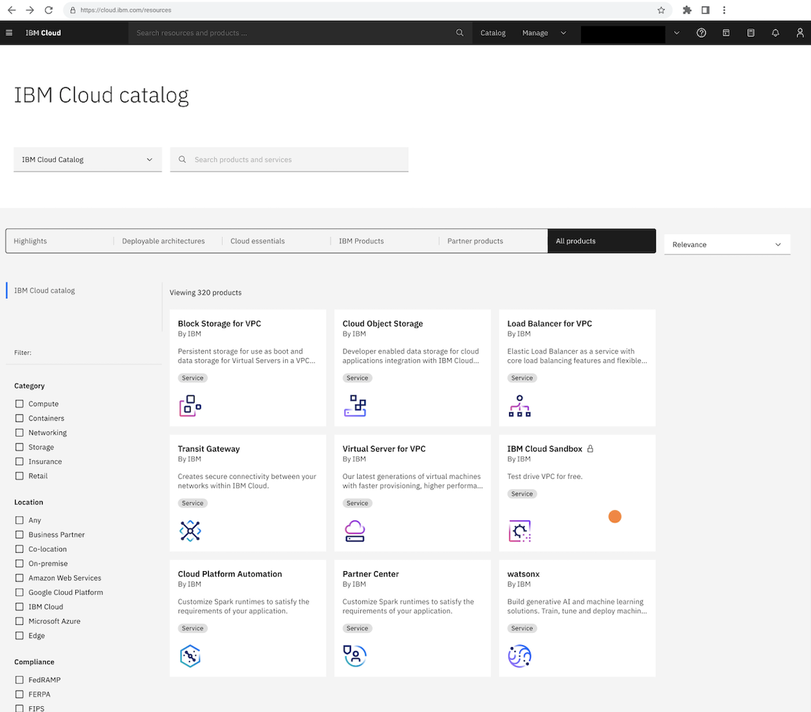
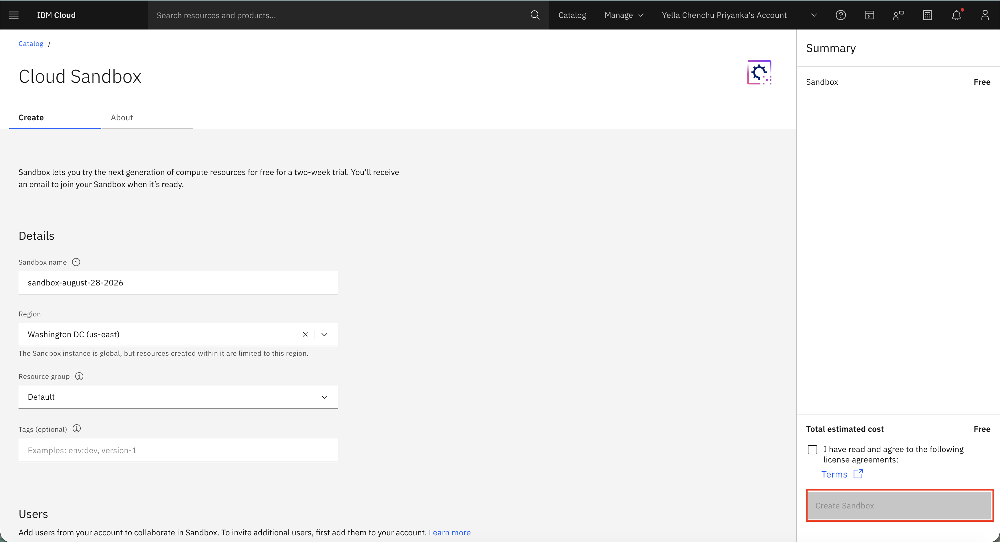
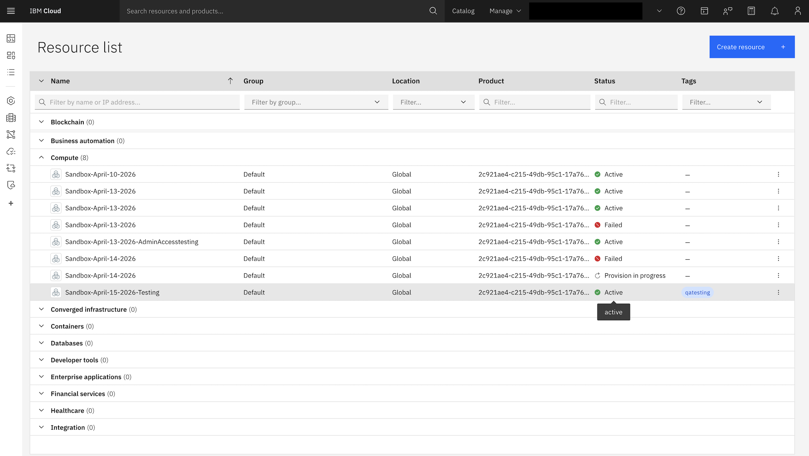
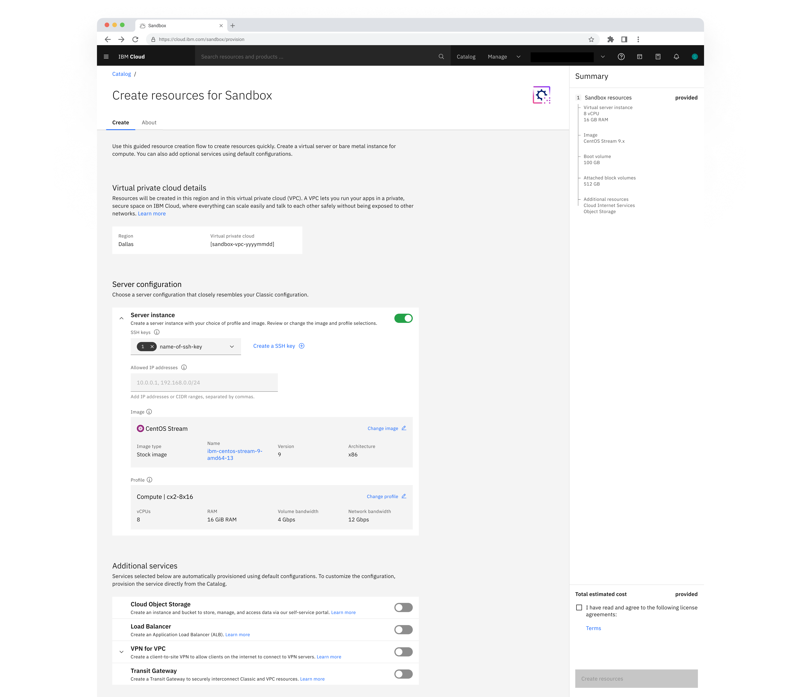

---

copyright:
  years: 2026
lastupdated: "2026-08-26"

keywords:

subcollection: sandbox

content-type: release-note

---

{{site.data.keyword.attribute-definition-list}}

# Provisioning the {{site.data.keyword.sandbox_full_notm}}
{: #deploy}

Provision IBM Cloud Sandbox to quickly create a secure, isolated environment for exploring IBM Cloud VPC services, where you can configure your Sandbox environment, invite users, and begin provisioning resources for testing and evaluation.

## Pre-requisites
{: #pre-req}

Ensure that you add access policies and grant administrator-level access to the following services:

* All Identity and Access–enabled services
* All Account Management services
* Cloud Sandbox

Bare metal is subjected to capacity validation.
{: note}

## Creating a Sandbox instance
{: #create-ui}

Only one Sandbox is allowed per allowlisted customer account.
{: note}

1. Navigate to the [{{site.data.keyword.Bluemix_notm}} catalog](https://cloud.ibm.com/catalog#highlights){: external} and search for the **Sandbox** offering.

    {: caption="Sandbox - Catalog page" caption-side="bottom"}

2. In the **Create** tab, provide the following information under **Details**:

    * **Sandbox name** - Name of the Sandbox instance.

    * **Region** - Region where the instance is provisioned.

    You will not be able to change the region once selected during the provisioning.
    {: note}

    * **Resource group** - Name from your {{site.data.keyword.Bluemix_notm}} account where the Sandbox resource will be deployed.

    * **Tags** (optional) - Use the tags to organize your resources.

    {: caption="Sandbox - Create" caption-side="bottom"}

3. In the **Users** section, you can select users from your account.

4. Accept the terms and conditions, click **Create Sandbox**.

Sandbox account is provisioned now. This includes a 14-day trial period with a 2 days (48 hours) extension. User access is limited to the region selected during provisioning.

A user can create up to three Sandbox environments per year. Only one Sandbox can be active at any given time.
{: note}

## Accessing Sandbox
{: #access-sandbox}

The Sandbox instance is displayed in the Resource list. To access the Sandbox environment:

1. Click on the Sandbox instance name in the **Resource list**.

    {: caption="Sandbox - Resource list" caption-side="bottom"}

2. On the user management page:
    
    - Click **Launch Sandbox** to provision the required resources.
    - From the **Actions** drop-down, you can **View docs**, Extend the Sandbox duration, and End the Sandbox early.
    - Under the **Users** section, you can add new users or remove the existing users.

    For additional information, use the **Helpful Links** section to access **Documentation**, **Videos**, and **Feedback resources**.

3. Click on the link in the welcome email.

## Creating resources in the Sandbox environment
{: #create-resources-sb}

You can create virtual servers or bare metal servers along with other VPC services.

1. On the **Sandbox Overview** page, click **Create resources**.

2. Under **Server configuration**, click **Create a SSH key** to create a SSH key to access the server.

3. To select from all the available images, click **Change image**. To select from all the available profiles, click **Change profile**.

4. Under **Additional services**, you can enable and customize the services.

    * {{site.data.keyword.cos_full_notm}}
    * Load Balancer
    * VPN for VPC
    * Transit Gateway

    {: caption="Sandbox - Create resources" caption-side="bottom"}

5. Accept the terms and conditions, click **Create resources**.

Once resources have been created, you can view them from the **Resource list**.

## Supported actions
{: #actions-sb}

Following are the supported actions available on the **Sandbox Overview** page:

* Extend the Sandbox trial
* End the Sandbox early
* Save the configuration

### Extending Sandbox
{: #extend-sb}

You can optionally extend the Sandbox trial for 2 days (48 hours) by clicking on **Extend Sandbox**. You will get an email confirming extension was granted and the countdown banner will increase by 2 days.

Users can create up to three Sandboxes per year, with only one active Sandbox allowed at any given time.
{: important}

### End Sandbox
{: #end-sb}

You can optionally end the Sandbox trial any time by clicking **End Sandbox**. If you do so, the account will be suspended and you will not be able to access the resources you have created. The data will be securely stored in COS bucket with object lock enabled. After this period, resources will be deleted, reclaim processes will be completed, and the account will be suspended.

The 21-day cooling period begins on the date the Sandbox is terminated, regardless of whether it ends normally or is ended early by the user. A new Sandbox can be created only after the cooling period has been completed.
{: important}

It is recommended to save the configuration, so that you can easily replicate your setup in your own account.
{: tip}

### Save configuration
{: #save-config-sb}

The Sandbox environment configuration can be downloaded as a Terraform packaging by clicking on **Save configuration**. For more information, see [Save configuration](/docs/sandbox?topic=sandbox-save-config) topic.
