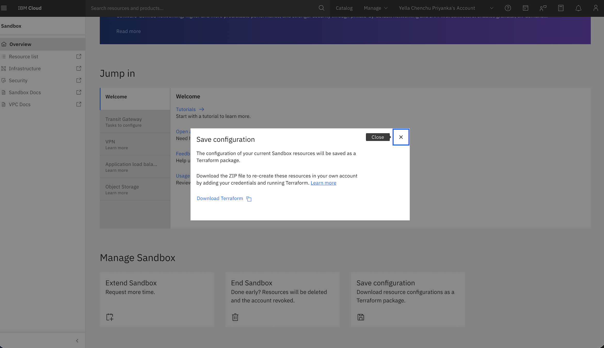

---

copyright:
  years: 2026
lastupdated: "2026-05-04"

keywords: save configuration, terraform, export configuration, download terraform, infrastructure as code, terraform files

subcollection: sandbox

---

{{site.data.keyword.attribute-definition-list}}

# Saving your Sandbox configuration
{: #save-config}

The Save configuration feature allows you to export your IBM Cloud Sandbox environment as ready-to-apply Terraform configuration files. This feature reads the live state of your Sandbox account and automatically generates Infrastructure as Code (IaC) that you can use to recreate your environment in a production account.
{: shortdesc}

You can find the Save configuration option in [Sandbox Overview](https://cloud.ibm.com/sandbox/overview) page.

After your 14-day trial period expires, all Sandbox resources are automatically deleted. Use the **Save configuration** feature to preserve your infrastructure setup before the trial ends.
{: important}

## How it works
{: #save-config-how-it-works}

The **Save configuration** feature uses the POST `/v1/configuration/save` API to generate terraform files from your live Sandbox environment. The process includes the following steps:

1. **Authentication** - The system authenticates into your Sandbox account by using a trusted profile and generates a temporary token to access your resources.

2. **Resource discovery** - Using the temporary token, the system calls IBM Cloud APIs to retrieve the complete configuration of all resources in your specified account and region.

3. **Terraform generation** - All discovered resources are converted into terraform configuration files with proper resource definitions, data sources, and variables.

4. **Package creation** - The generated terraform files are packaged into a `.zip` archive in memory.

5. **Download** - The `.zip` file is sent to you as a downloadable package that you can apply in your production account.

## Generated Terraform files
{: #save-config-terraform-files}

The downloaded `.zip` archive contains the following Terraform configuration files:

| File name | Description |
|-----------|-------------|
| `provider.tf` | IBM Cloud provider configuration and authentication setup |
| `main.tf` | All resource definitions for your infrastructure components |
| `variables.tf` | Input variable declarations (region, API key, and resource-specific variables) |
| `data.tf` | Data source lookups for existing resources and dependencies |
| `terraform.tfvars` | Placeholder file for user credentials and variable values |
{: caption="Generated Terraform files" caption-side="bottom"}

## Supported resources
{: #save-config-supported-resources}

The Save sonfiguration feature retrieves and converts the following IBM Cloud resources into Terraform configuration:

### VPC infrastructure resources
{: #save-config-vpc-resources}

| Resource | Terraform resource type |
|----------|------------------------|
| SSH keys | `ibm_is_ssh_key` |
| VPCs | `ibm_is_vpc` |
| Subnets | `ibm_is_subnet` |
| Virtual Server Instances (VSIs) | `ibm_is_instance` |
| Security Groups | `ibm_is_security_group` |
| Security Group Rules | `ibm_is_security_group_rule` |
| Floating IPs | `ibm_is_floating_ip` |
| Public Gateways | `ibm_is_public_gateway` |
| Network ACLs | `ibm_is_network_acl` |
| Routing Tables | `ibm_is_vpc_routing_table` |
| Routes | `ibm_is_vpc_routing_table_route` |
| Placement Groups | `ibm_is_placement_group` |
| Bare Metal Servers | `ibm_is_bare_metal_server` |
{: caption="VPC infrastructure resources" caption-side="bottom"}

### Load balancers and VPN resources
{: #save-config-lb-vpn-resources}

| Resource | Terraform resource type |
|----------|------------------------|
| Load Balancers | `ibm_is_lb` |
| Load Balancer Pools | `ibm_is_lb_pool` |
| Load Balancer Listeners | `ibm_is_lb_listener` |
| VPN Gateways | `ibm_is_vpn_gateway` |
| VPN Gateway Connections | `ibm_is_vpn_gateway_connection` |
| VPN Servers (Client-to-Site) | `ibm_is_vpn_server` |
| IKE Policies | `ibm_is_ike_policy` |
| IPsec Policies | `ibm_is_ipsec_policy` |
{: caption="Load balancing and VPN resources" caption-side="bottom"}

### Network connectivity resources
{: #save-config-network-resources}

| Resource | Terraform resource type |
|----------|------------------------|
| Transit Gateways | `ibm_tg_gateway` |
| Transit Gateway Connections | `ibm_tg_connection` |
| Direct Link Gateways | `ibm_dl_gateway` |
{: caption="Network connectivity resources" caption-side="bottom"}

### Platform services
{: #save-config-platform-resources}

| Resource | Terraform resource type |
|----------|------------------------|
| Cloud Object Storage Instances | `ibm_resource_instance` |
| Cloud Object Storage Buckets | `ibm_cos_bucket` |
| Secrets Manager Instances | `ibm_resource_instance` (Secrets Manager) |
| Cloud Internet Services Instances | `ibm_resource_instance` |
| CIS Domains | `ibm_cis_domain` |
| CIS DNS Records | `ibm_cis_dns_record` |
{: caption="Platform services" caption-side="bottom"}

### IAM resources
{: #save-config-iam-resources}

| Resource | Terraform resource type |
|----------|------------------------|
| Access Groups | `ibm_iam_access_group` |
| Access Group Members | `ibm_iam_access_group_members` |
| Access Group Dynamic Rules | `ibm_iam_access_group_dynamic_rule` |
| Access Group Policies | `ibm_iam_access_group_policy` |
{: caption="IAM resources" caption-side="bottom"}

The following resources are not included in the generated Terraform configuration:

* **IAM users** - User identities are account-specific and typically not managed through Terraform
* **Schematics workspaces** - Workspace configurations are not exported
* **IBM Cloud Projects** - Project resources are not included in the export

## Saving your configuration
{: #save-config-procedure}

To save your Sandbox configuration and download the Terraform package:

1. Navigate to the [Sandbox Overview](https://cloud.ibm.com/sandbox/overview) page from your resource list.

2. In the **Manage Sandbox** section, click **Save Configuration**.

   {: caption="Figure 1. Save configuration option" caption-side="bottom"}

3. Click **Download Terraform**. The system generates the Terraform configuration files from your live environment. This process can take a few minutes depending on the number of resources in your account. After generation is complete, a `.zip` file is automatically downloaded to your local machine.

4. Extract the downloaded `.zip` file to a working directory.


## Applying the configuration in your production account
{: #save-config-apply}

After downloading and extracting the Terraform configuration, you can apply it to your production IBM Cloud account:

### Before you begin
{: #save-config-prereqs}

* Ensure that you are logged into a Pay-As-You-Go IBM Cloud account.
* Install [Terraform CLI](https://www.terraform.io/downloads){: external} (version 1.0 or later)
* Install the [IBM Cloud CLI](/docs/cli?topic=cli-getting-started)
* Have an IBM Cloud API key with appropriate permissions for the resources you want to create

### Procedure
{: #save-config-apply-steps}

1. Navigate to the extracted directory:

   ```sh
   cd /path-to-extracted-terraform-config
   ```
   {: pre}

3. Update the `terraform.tfvars` file with your IBM Cloud credentials and desired values. For available region values, see [Creating a VPC in a different region](/docs/vpc?topic=vpc-creating-a-vpc-in-a-different-region&interface=cli).

   ```hcl
   ibmcloud_api_key = "your-api-key"
   region = "<<enter the region>>"
   ```
   {: codeblock}

4. Initialize Terraform to download the required providers:

   ```sh
   terraform init
   ```
   {: pre}

5. Review the planned changes:

   ```sh
   terraform plan
   ```
   {: pre}

6. Apply the configuration to create resources in your production account:

   ```sh
   terraform apply
   ```
   {: pre}

7. When prompted, type `yes` to confirm the resource creation.

## Best practices
{: #save-config-best-practices}

* **Save early and often** - Download your configuration multiple times during your trial period to capture different stages of your infrastructure development.

* **Review before applying** - Always run `terraform plan` to review the resources that are created before applying the configuration.

* **Customize for production** - The generated configuration is a starting point. Review and modify it to meet your production requirements, including security policies, naming conventions, and resource sizing.

* **Manage sensitive data** - Never commit the `terraform.tfvars` file containing your API key to version control. Use environment variables or secure secret management solutions.

* **Test in a non-production environment** - Before applying to production, test the Terraform configuration in a development or staging environment.

## Limitations
{: #save-config-limitations}

* The Save Configuration feature captures the current state of your resources at the time of export. Any changes made after the export are not included.

* Some resource attributes can require manual adjustment in the generated Terraform files, particularly for resources with complex dependencies.

* The generated configuration uses default variable names and may require customization to match your organization's naming standards.

* Resource quotas and limits in your production account might differ from the Sandbox environment. Verify that your account has sufficient quota before applying the configuration.

## Next steps
{: #save-config-next-steps}

* [Understanding Terraform basics](/docs/ibm-cloud-provider-for-terraform?topic=ibm-cloud-provider-for-terraform-getting-started)
* [Managing infrastructure with Terraform](/docs/ibm-cloud-provider-for-terraform?topic=ibm-cloud-provider-for-terraform-manage_resources)
* [Extending your Sandbox trial](/docs/sandbox?topic=sandbox-deploy#deploy)
